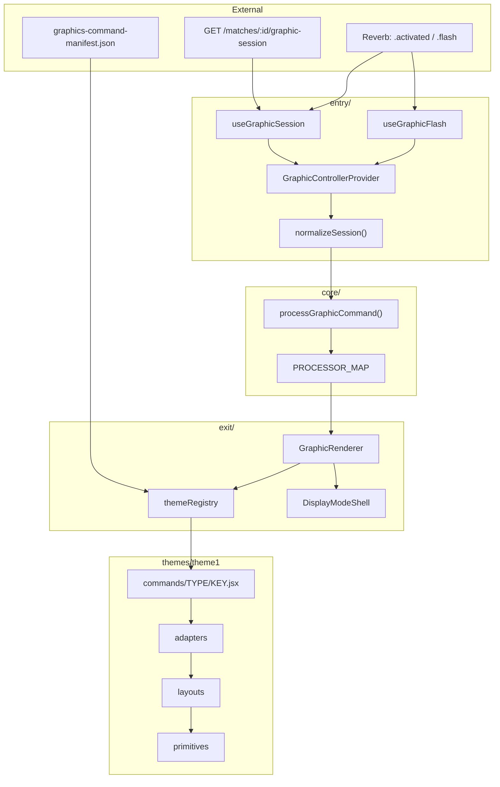

# Graphics Module — Architecture (single source of truth)

**Scope:** `app/src/graphics` and its integration with the Tapeya broadcast stack  
**Version:** 3.1 · **Last updated:** June 2026  
**Status:** Production-ready for `theme1`. P0–P3 hardening complete. Theme 2 blocked only on layout-strategy decision (§11).

**Related (outside this module):** [`shared/graphics-command-manifest.json`](../../../shared/graphics-command-manifest.json), [`shared/graphics-themes.json`](../../../shared/graphics-themes.json), [`docs/BALL_DELIVERY_ARCHITECTURE.md`](../../../docs/BALL_DELIVERY_ARCHITECTURE.md), [`tapeya-theme-controller/`](../../../tapeya-theme-controller/) (design harness).

---

## How to use this document

| If you need…                         | Read    |
| ------------------------------------ | ------- |
| Pipeline, folders, layer rules       | §3–§5   |
| Add a new command                    | §11     |
| Start theme 2                        | §10     |
| Tests, CI, what catches regressions  | §8–§9   |
| **CSS / vMix browser compatibility** | **§17** |
| What's done vs still open            | §2, §13 |
| Naming conventions                   | §15     |

---

## 1. Executive summary

The graphics module uses a **layered, theme-agnostic pipeline**:

```
entry (React wiring) → core (normalize + process) → exit (lazy render) → themes (visual)
```

| Layer       | Responsibility                                          | Theme-aware?  |
| ----------- | ------------------------------------------------------- | ------------- |
| **entry**   | Session load, WebSocket, flash queue, provider          | No            |
| **core**    | Normalize API session → `componentProps`                | No            |
| **exit**    | Resolve theme component, display shells, error boundary | Registry only |
| **themes/** | Adapters, layouts, primitives, styles                   | Yes           |

**Verdict:** Production-ready for one theme. ~**80% future-proof** for theme 2 kickoff — registry, drift CI, integration smoke, and adapter contracts are in place. Full multi-theme scale still implies ~179 files per distinct visual design unless shared layouts are extracted (§11).

---

## 2. At a glance

| Metric                          | Value                                                                       |
| ------------------------------- | --------------------------------------------------------------------------- |
| Registered themes               | 1 (`theme1`)                                                                |
| Manifest command keys           | 95                                                                          |
| Theme JSX files                 | 93 (`LT_EMPTY`, `ADD_CAPTION` have no JSX by design)                        |
| Processor map entries           | ~94 overlay keys (manifest-driven)                                          |
| Adapter modules                 | 17 domain + `_shared` + `adapterContracts.js`                               |
| Layout components               | 38 (`bars/`, `full-screen/`, `charts/`, `shared/`)                          |
| Files under `themes/theme1/`    | ~179                                                                        |
| Total under `app/src/graphics/` | ~228                                                                        |
| Tests                           | **232** graphics-only · **255** full app (`npm test -- --run src/graphics`) |

### Health scorecard (post P0–P3)

| Dimension                                       | Status                                                              |
| ----------------------------------------------- | ------------------------------------------------------------------- |
| Layer separation (entry / core / exit / themes) | ✅ Strong                                                           |
| Manifest-driven processor map                   | ✅ `processorRegistry.js` + loop in `processorMap.js`               |
| Normalizer testability                          | ✅ Split modules + `normalizeSession.test.js`                       |
| Integration + render smoke                      | ✅ `pipeline.integration.test.js` + `commandSmoke.test.js`          |
| Adapter formal contracts                        | ⚠️ 25 high-traffic paths; expand before/during theme 2              |
| Presentation copy in theme                      | ✅ `presentationLabels.js` + adapters (incl. toss/result)           |
| TypeScript                                      | ⚠️ Started (`typecheck:graphics` on 2 files); full `core/` deferred |
| Pixel visual regression                         | ⚠️ Playwright shell smoke only (3 commands)                         |

---

## 3. Pipeline overview



### Session lifecycle

1. **Load** — RTK Query fetches signed overlay session (HTTP).
2. **Live updates** — Reverb `.match.graphic.activated` patches cache via `graphicSessionSync.js`.
3. **Context refresh** — `context_hash` change triggers full context refetch over HTTP.
4. **Normalize** — `normalizeSession(rawSession, themeSlug)` → `GraphicSessionSnapshot`.
5. **Flash override** — `applyFlashToSnapshot()` applies manifest `type` / `displayMode` when flash queue active.
6. **Process** — `PROCESSOR_MAP[commandKey](snapshot)` → `componentProps`.
7. **Plan** — `GraphicRenderPlan` with metadata + tokens.
8. **Render** — Lazy JSX via `getThemeCommandComponent()` + display shell + `ThemeRoot`.

**Processor return semantics:** `null` → no plan (blank overlay); `{}` → empty props (clear/animation); object → normal render.

**Theme selection:** `session.theme.slug` from the graphic session API (SSOT). Signed overlay page URLs no longer carry `?theme=`; changing theme in backoffice updates OBS after refresh or the next Reverb theme change refetch.

---

## 4. Directory structure

```
app/src/graphics/
├── ARCHITECTURE.md                 ← this file (SSOT)
├── types.js                        JSDoc contracts
│
├── core/                           Theme-agnostic (never imports themes/)
│   ├── normalizeSession.js         barrel → normalizeSession/
│   ├── normalizeSession/           teams, match, live, deliveries, config
│   ├── GraphicCommandProcessor.js
│   ├── processorRegistry.js        processorId → function
│   ├── processorMap.js             manifest loop → PROCESSOR_MAP
│   ├── manifestCommandMeta.js      flash override; type/displayMode lookup
│   ├── graphicCommandKeys.js       AUTO-GENERATED from PHP
│   ├── contextHash.js, utils.js
│   ├── domain/player.js
│   ├── processors/                 domain files + _shared/ + __tests__/
│   └── __tests__/
│
├── entry/                          Overlay wiring
│   ├── GraphicOverlay.jsx          gates on ensureThemeAssetsLoaded()
│   ├── GraphicControllerProvider.jsx
│   ├── GraphicEchoProvider.jsx
│   └── hooks/                      session, flash, channel, graphicSessionSync
│
├── exit/                           Single render exit
│   ├── GraphicRenderer.jsx
│   ├── GraphicErrorBoundary.jsx    resets on contextHash change
│   ├── themeRegistry.js            glob loader + graphics-themes.json
│   └── shells/                     LT / FS / passthrough
│
├── __tests__/                      integration, command smoke, fixtures
│
├── shared/                         Cross-theme utilities (themes import; core does not)
│   ├── accentColor.js              vMix-safe color resolve + mix (no color-mix())
│   └── index.js
│
└── themes/
    └── theme1/
        ├── themeMeta.js            ThemeRoot; styleImports (lazy-loaded)
        ├── config.js → _tokens.css
        ├── adapters/               17 *.adapter.js + adapterContracts.js
        ├── commands/{TYPE}/        93 JSX files
        ├── layouts/                bars, full-screen, charts, shared
        ├── primitives/
        └── styles/
```

### Commands by TYPE (93 JSX)

| TYPE                             | Count | Role                                   |
| -------------------------------- | ----- | -------------------------------------- |
| `LOWER_THIRD`                    | 33    | Scoreboard, match chrome, officials    |
| `FULL_SCREEN`                    | 16    | Squads, summaries, MOM                 |
| `FULL_SCREEN_TRANSITION`         | 10    | Event flash headers                    |
| `BATSMAN_STATS` / `BOWLER_STATS` | 7 / 6 | Player LT/FS                           |
| `TOUR_HITS`                      | 6     | Tournament milestone bars              |
| `BREAK`                          | 5     | Innings/lunch/tea/rain/timeout         |
| `TOURNAMENT`                     | 5     | Leaderboards, point table              |
| `CHART`                          | 4     | Worm, Manhattan, run rate, wagon wheel |
| `CAPTION`                        | 1     | Custom caption                         |

---

## 5. Layer responsibilities

### `core/` — data & processing

Processors know **cricket domain**, not visual presentation. English copy lives in theme adapters (`presentationLabels.js`).

| Artifact               | Role                                                     |
| ---------------------- | -------------------------------------------------------- |
| `normalizeSession/`    | snake_case API → camelCase `GraphicSessionSnapshot`      |
| `processorRegistry.js` | Shared `processorId` implementations                     |
| `processorMap.js`      | Builds map from manifest + registry; animation/FST loops |
| `processors/_shared/`  | `scoreboardBase`, `matchContext`, `resolvePlayer`, etc.  |

**Adding a processor:** PHP enum → manifest export → `PROCESSOR_REGISTRY` entry → (map is automatic) → theme JSX.

### `entry/` — React integration

| File                        | Role                                                    |
| --------------------------- | ------------------------------------------------------- |
| `useGraphicSession`         | HTTP + Reverb activation + flash hash refetch           |
| `useGraphicFlash`           | 5s flash queue (separate listener — refetch vs display) |
| `graphicSessionSync.js`     | Pure patch helpers (unit tested)                        |
| `GraphicControllerProvider` | Sole production caller of `processGraphicCommand`       |

`isError` is exposed in context but overlay stays blank (OBS-safe). Optional debug banner deferred.

### `exit/` — rendering

- Lazy command components: `import.meta.glob('../themes/*/commands/*/*.jsx')`
- `ensureThemeStylesLoaded(slug)` — CSS/SCSS per active theme only
- `ensureThemeFontsLoaded(slug)` — Google Fonts from `themeMeta.googleFontsUrl` (onload → `fonts.load()` per family)
- `ensureThemeAssetsLoaded(slug)` — styles + fonts in parallel (overlay gate)
- Shells inject team CSS vars (`--home-bg`, etc.)

### `themes/theme1/` — visual implementation

**CSS:** All translucent accents, borders, and glows must use §17 helpers — never `color-mix()` or `100dvh` in theme files.

Three command tiers (by design):

| Tier         | Pattern                                   | ~Count |
| ------------ | ----------------------------------------- | ------ |
| Data graphic | processor → adapter → layout → primitives | ~75    |
| Animation LT | primitives only (`FourBar`, `SixFlash`)   | ~15    |
| FST event    | adapter + ControllerBar + flash           | ~10    |

Typical data command:

```jsx
// commands/LOWER_THIRD/LT_DEFAULT.jsx
const bundle = toScoreBarBundle(props, tokens);
return (
  <BroadcastShell stage="bar">
    <LowerThirdBar {...bundle} />
  </BroadcastShell>
);
```

---

## 6. Single source of truth wiring

```
PHP GraphicCommandKeyEnum
  → shared/graphics-command-manifest.json   (type, category, displayMode, processorId)
  → core/graphicCommandKeys.js              (AUTO-GENERATED)
  → core/processorRegistry.js               (processorId → fn)
  → core/processorMap.js                    (manifest loop)
  → themes/{slug}/commands/{TYPE}/{KEY}.jsx

shared/graphics-themes.json                 (slug → folder, completeness)
exit/themeRegistry.js                       (glob + meta)
scripts/check-graphics-drift.js             (CI parity)
```

---

## 7. Types & contracts

`types.js` defines JSDoc contracts: `GraphicSessionSnapshot`, `GraphicRenderPlan`, `GraphicProcessor`, `ThemeTokens`.

**Gaps:** `match` / `live` / `tournament` are loose `Object`. Adapter bundle shapes partially formalized in `adapterContracts.js` (25 commands) + `adapters.test.js`.

**TypeScript:** `src/graphics/tsconfig.json` + `npm run typecheck:graphics` (checkJs on `manifestCommandMeta.js`, `types.js`).

---

## 8. Testing & CI

### Commands

```bash
cd app && npm test -- --run src/graphics    # 232 graphics tests
cd app && npm run typecheck:graphics
node scripts/check-graphics-drift.js
cd app && npm run test:e2e:graphics         # Playwright fixture shell (3 commands)
```

### CI (`.github/workflows/graphics-checks.yml`)

| Job                  | Checks                                       |
| -------------------- | -------------------------------------------- |
| `drift`              | manifest ↔ registry ↔ processors ↔ theme JSX |
| `overlay-tests`      | Full app unit tests                          |
| `graphics-typecheck` | `typecheck:graphics`                         |
| `graphics-visual`    | Playwright fixture smoke                     |
| `manifest-export`    | PHP enum export matches committed manifest   |
| `theme-controller`   | Vendor sync + harness build                  |

### Test matrix (what protects what)

| File                                   | Protects against                            |
| -------------------------------------- | ------------------------------------------- |
| `normalizeSession.test.js`             | Normalizer input-shape regressions          |
| `processorMapIntegrity.test.js`        | Wrong processor wired to key                |
| `processors.test.js`                   | Processor domain logic                      |
| `pipeline.integration.test.js`         | Every overlay key → plan + registry         |
| `commandSmoke.test.js`                 | Every command SSR render + shell markers    |
| `adapterContracts.test.js`             | 25 processor→adapter bundle keys            |
| `adapters.test.js`                     | Full adapter logic (broader than contracts) |
| `GraphicControllerProvider.test.js`    | Plan build, flash override                  |
| `GraphicRenderer.test.js`              | Theme root + shell assembly                 |
| `themeRegistry.test.js`                | Slug/type resolution                        |
| `GraphicErrorBoundary.test.jsx`        | Render errors; hash recovery                |
| `graphicSessionSync.test.js`           | Reverb cache patches                        |
| `accent.test.js`                       | Theme1 accent wrapper + glow integration    |
| `shared/__tests__/accentColor.test.js` | Shared color resolve/mix (§17, all themes)  |

**Not covered:** lazy-load runtime path in tests (smoke uses eager imports); pixel/screenshot baselines; cross-theme parity (no theme 2 yet).

---

## 9. Safeguards summary

| Safeguard                        | Status                                   |
| -------------------------------- | ---------------------------------------- |
| Manifest ↔ processor parity      | ✅ Drift CI                              |
| Manifest ↔ theme JSX parity      | ✅ Drift CI                              |
| Wrong processor function wired   | ✅ `processorMapIntegrity.test.js`       |
| Adapter bundle shape (25 paths)  | ✅ `adapterContracts.test.js`            |
| PHP manifest export drift        | ✅ CI `manifest-export` job              |
| Error boundary context recovery  | ✅ `contextHash` reset                   |
| Legacy `themes/tapeya/` folder   | ✅ Drift CI forbids                      |
| Token `_tokens.css` commit drift | ❌ Not diff-checked in CI (optional add) |
| Runtime theme slug validation    | ❌ Invalid slug → blank overlay          |
| vMix 24 CSS (`color-mix`, `dvh`) | ⚠️ Convention + §17; not CI-enforced yet |

---

## 10. Theme 2 development

### Step 0 — Decide layout strategy (required)

| Answer                                | Approach                                                     |
| ------------------------------------- | ------------------------------------------------------------ |
| **Same structure, different styling** | Shared layouts + token-driven CSS; do **not** copy 179 files |
| **Different broadcast design**        | Full fork: copy `theme1/` → `theme2/`, restyle independently |

Do not bulk-copy files until design stakeholders answer this.

### Registration checklist

1. Add entry to [`shared/graphics-themes.json`](../../../shared/graphics-themes.json) — start `"completeness": "partial"` with whitelist (e.g. `LT_DEFAULT`, `LT_FOUR`, `PLAYING_11`).
2. Create `themes/theme2/themeMeta.js` (include `googleFontsUrl` + `googleFontFamilies` for overlay font loading), `config.js`, `commands/`, `adapters/`, etc.
3. Run `npm run generate:tokens` for theme2; `node scripts/check-graphics-drift.js`.
4. OBS: use the signed overlay URL from backoffice; theme follows `graphic_theme_id` on the session (no `?theme=` param).
5. Add parameterized contract tests: same processor fixture → theme1 + theme2 adapters expose required bundle keys.
6. Promote to `"completeness": "full"` when every overlay key has JSX.

### Rules

- **Never** import theme code from `core/`.
- Use generic adapter names inside each theme (`toScoreBarBundle`, not `toTheme1…`).
- Processors stay theme-agnostic; themes reimplement all 17 adapters unless `_shared/` is deliberately extracted.
- Cost model: partial theme ~30–50 files; full theme ~179 files.
- Follow **§17** for all theme CSS — same rules apply to `theme2/` layouts, primitives, and SCSS.
- Import color helpers from **`shared/accentColor.js`**; add a thin `primitives/accent.js` with theme token defaults.

---

## 11. Adding a new command

```
1. PHP GraphicCommandKeyEnum entry
2. php artisan graphics:export-manifest  (CI enforces committed sync)
3. PROCESSOR_REGISTRY entry in processorRegistry.js
4. themes/theme1/commands/{TYPE}/{KEY}.jsx
5. node scripts/check-graphics-drift.js && npm test -- --run src/graphics
```

**Implementation pattern:**

```
Is category = animation?
  ├─ FST → adapter? + ControllerBar + *Flash
  └─ LT  → *Bar + *Flash from primitives

Is category = clear / backoffice_only?
  └─ No JSX; processor only (or neither)

Else (data graphic):
  └─ processor → adapter → layout → primitives → BroadcastShell
```

**Before merge — CSS compatibility (§17):**

- No `color-mix()` in theme JSX, inline styles, or SCSS.
- Translucent accents → `accentMix()` / `accentGlowShadow()` (not Tailwind arbitrary `color-mix` classes).
- No `100dvh` in overlay or theme styles.

---

## 12. Hardening completed (P0–P3)

| #    | Item                                                                     | Status                            |
| ---- | ------------------------------------------------------------------------ | --------------------------------- |
| P0-1 | `normalizeSession.test.js` + split sub-modules                           | ✅                                |
| P0-2 | Manifest-driven `PROCESSOR_MAP`                                          | ✅                                |
| P0-3 | Registry, facade, `processorMapIntegrity` tests                          | ✅                                |
| P0-4 | Theme 2 onboarding doc                                                   | ✅                                |
| P0-5 | Adapter rename (drop Theme1 prefix)                                      | ✅                                |
| P1   | Pipeline integration, entry/exit tests, presentation labels              | ✅                                |
| P2   | Lazy theme CSS, adapter contracts (25), manifest export CI               | ✅                                |
| P3   | Command smoke, Playwright fixtures, error boundary, FS flash, TS started | ✅                                |
| P3   | `themes/_shared/` extraction                                             | ⏸️ Deferred — §10 layout decision |

**Refactor phases 1–5** (boundary cleanup, domain extraction, dynamic theme meta, layouts rename) — all complete. Details archived in git history; no action required.

---

## 13. Open & deferred (not blockers)

| Item                       | Recommendation                                                                      |
| -------------------------- | ----------------------------------------------------------------------------------- |
| Adapter contracts 25/~40   | **Leave** until theme 2 or adapter change; many paths already in `adapters.test.js` |
| Full TypeScript `core/`    | **Defer** until theme 2 or core churn slows                                         |
| Pixel Playwright snapshots | **Defer** — high maintenance; shell smoke + commandSmoke sufficient for now         |
| `themes/_shared/`          | **Defer** — blocked on §10 layout decision                                          |
| `isError` debug banner     | **Optional** — blank overlay is OBS-safe                                            |
| Duplicate flash listeners  | **Leave** — intentional (hash refetch vs queue)                                     |
| Token CSS diff in CI       | **Add when convenient** — ~5 lines in workflow                                      |
| Layout unit tests (37/38)  | **Leave** — exercised via command smoke                                             |

---

## 14. Cross-repo integration

| Location                                 | Role                                                         |
| ---------------------------------------- | ------------------------------------------------------------ |
| `shared/graphics-command-manifest.json`  | Command catalog                                              |
| `shared/graphics-themes.json`            | Theme registry                                               |
| `scripts/check-graphics-drift.js`        | Structural parity                                            |
| `app/src/store/api/graphicSessionApi.js` | RTK Query session                                            |
| `app/src/App.jsx`                        | `/overlay/:matchId` (+ signed `expires` / `signature` query) |
| `tapeya-theme-controller/`               | Standalone design harness                                    |

---

## 15. Naming conventions

| Artifact       | Convention                       | Example               |
| -------------- | -------------------------------- | --------------------- |
| Command key    | `SCREAMING_SNAKE`                | `LT_DEFAULT`          |
| TYPE folder    | Manifest `type`                  | `LOWER_THIRD`         |
| Command file   | `{commandKey}.jsx`               | `LT_DEFAULT.jsx`      |
| Processor      | `process{Feature}`               | `processTossLt`       |
| Adapter file   | `{domain}.adapter.js`            | `scoreBar.adapter.js` |
| Adapter export | `to{Target}Bundle`               | `toScoreBarBundle`    |
| Layout         | `{Purpose}{Bar\|Graphic\|LTBar}` | `MatchSummaryLTBar`   |
| Theme slug     | lowercase                        | `theme1`              |

---

## 17. Browser & CSS compatibility (overlay / vMix)

The signed overlay (`/overlay/:matchId`) runs inside **OBS**, **vMix 29**, and **vMix 24**. vMix 24 embeds an old Chromium (~86–103). Graphics that rely on Chrome 111+ CSS can render **blank or broken** in vMix 24 while working everywhere else.

**Scope:** All code under `themes/` (JSX, SCSS, inline styles). The main Tapeya app may use newer CSS elsewhere; **theme overlay assets must not**.

### Do not use in themes

| Feature                                       | Chrome min | Why it breaks                                                            |
| --------------------------------------------- | ---------- | ------------------------------------------------------------------------ |
| `color-mix()`                                 | 111        | Invalid/ignored in vMix 24 → missing borders, glows, gradients           |
| `color-mix` inside Tailwind arbitrary classes | 111        | Same — e.g. `border-[color-mix(in_srgb,var(--accentA)_40%,transparent)]` |
| `100dvh`                                      | 108        | Low risk but avoid in overlay/theme CSS; use `100vh` or fixed px         |
| Hard-coded `color-mix` in `@keyframes`        | 111        | Use `#rrggbbaa` or `rgba()` instead                                      |

**Do not** add `@supports (color: color-mix(...))` blocks in theme SCSS expecting a fallback — theme bundles are loaded as-is in vMix. Always ship the legacy-safe value directly.

### Use instead — SSOT helpers

| Need                             | Use                                                   | Location                                                                         |
| -------------------------------- | ----------------------------------------------------- | -------------------------------------------------------------------------------- |
| Color resolve + mix (all themes) | `mixColorWithTransparent()`, `resolveCssColorRgb()`   | **`shared/accentColor.js`** (SSOT)                                               |
| Translucent team/global accent   | `accentMix(accent, percent)`                          | `themes/{slug}/primitives/accent.js` (theme wrapper)                             |
| LT bar head gradient             | `accentPanelHeadGradient(accent)`                     | theme `primitives/accent.js`                                                     |
| Box glow from accent             | `accentGlowShadow(accent, percent, size)`             | `themes/theme1/visualEffects.js`                                                 |
| Halo on panels / labels          | `accentHaloShadow(accent, size, mixPercent)`          | `visualEffects.js`                                                               |
| Crest ring halo                  | `crestRingBoxShadow(accent)` + `crestRingClassName()` | `visualEffects.js`                                                               |
| Text neon (when enabled)         | `textGlowClass(variant)`                              | `visualEffects.js` — use existing variants; add `rgba()` only, never `color-mix` |

**Rules for `accentMix()` / `mixColorWithTransparent()`:**

- Shared logic lives in **`shared/accentColor.js`** — copy or import from there in theme 2; do not duplicate parsers.
- Pass the **accent string** you already have (`#rrggbb`, `rgb(...)`, or `'var(--accentA)'`). Do not hand-write `color-mix`.
- For hex inputs it returns **8-digit hex** (`#5b7cff21`); for vars/rgb it returns **`rgba(...)`** resolved at runtime.
- Prefer passing **team hex from props** over `'var(--accentA)'` when the adapter already supplies `accent`.
- Do **not** compute accent styles at **module scope** (e.g. top-level `const style = { borderColor: accentMix(...) }`) — resolve in render so CSS vars and team colors stay correct.

**Exports:** `primitives/index.js` re-exports `accentMix`, `accentPanelHeadGradient`, `accentGlowShadow`.

### Patterns

```jsx
// ✅ Border + glow — inline style
style={{
  borderColor: accentMix(accent, 40),
  boxShadow: `0 0 calc(22px * var(--glow)) ${accentMix(accent, 20)}, inset 0 1px 0 rgba(255,255,255,0.06)`,
}}

// ✅ LT head band
style={{ background: accentPanelHeadGradient(accent) }}

// ❌ Never — vMix 24
className="border-[color-mix(in_srgb,var(--accentA)_40%,transparent)]"
style={{ borderColor: 'color-mix(in srgb, var(--accentA) 40%, transparent)' }}
```

```scss
// ✅ Keyframes — fixed rgba or 8-digit hex matching default --accentA (#5b7cff)
box-shadow: 0 0 calc(12px * var(--glow, 1)) rgba(91, 124, 255, 0.35);

// ❌ Never
box-shadow: 0 0 calc(12px * var(--glow, 1)) color-mix(in srgb, var(--accentA) 35%, transparent);
```

When SCSS must follow `--accentA` but cannot call JS, use **precomputed rgba/hex for the default token** (`#5b7cff` → `91, 124, 255`). Dynamic per-team colors belong in JSX via `accentMix(teamColor, percent)`.

### Tailwind note (main app bundle)

Tailwind v4 in the shared SPA CSS may emit `@supports (color: color-mix(...))` with **8-digit hex fallbacks** for utilities like `bg-white/10`. That is OK for main-app pages; **do not rely on it in theme JSX/SCSS**. Theme chunks (`animations.css`, `controller.css`) must contain **zero** `color-mix`.

### Verification before deploy

```bash
# No color-mix in theme source
rg 'color-mix' app/src/graphics/themes/

# Theme CSS chunks clean after build
npm run build
rg 'color-mix' app/dist/assets/animations*.css app/dist/assets/controller*.css app/dist/assets/_tokens*.css
# (expect 0 matches)

cd app && npm test -- --run src/graphics/themes/theme1/primitives/__tests__/accent.test.js
```

Smoke in **vMix 24**: signed overlay URL, transparent background, highest browser version on the input, reload after deploy.

---

## 16. Appendix — file counts

| Path                        | Files    |
| --------------------------- | -------- |
| `core/`                     | ~28      |
| `entry/`                    | ~11      |
| `exit/`                     | 7        |
| `themes/theme1/adapters/`   | 18       |
| `themes/theme1/commands/`   | 93       |
| `themes/theme1/layouts/`    | 38       |
| `themes/theme1/primitives/` | 19       |
| **Total**                   | **~228** |

---

## Revision history

| Version | Date      | Changes                                                                                                                         |
| ------- | --------- | ------------------------------------------------------------------------------------------------------------------------------- |
| 1.0–1.2 | June 2026 | Initial structure doc; refactor phases; theme1 sync                                                                             |
| 2.0     | June 2026 | Split audit/review into separate docs                                                                                           |
| **3.0** | June 2026 | **Merged SSOT:** absorbed `GRAPHICS_MODULE_REVIEW.md` + `ARCHITECTURE_REVIEW.md`; theme 2 guide; P0–P3; test matrix; open items |
| **3.1** | June 2026 | §17 overlay CSS compatibility (`color-mix`, `100dvh`); SSOT accent helpers; merge checklist in §11                              |
