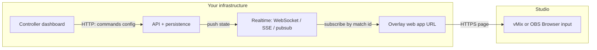

# Broadcast overlay integration (Crickslab-style reference)

This document captures how **browser-based graphics** integrate with production software such as **vMix** and **OBS**, using the workflow seen in products like **[Crickslab](https://crickslab.com/)** as a concrete reference. It complements [`MATCH_CONTROLLERS_BACKOFFICE.md`](./MATCH_CONTROLLERS_BACKOFFICE.md), which describes Tapeya’s backoffice controller, sessions, and commands.

---

## 1. Mental model (two sentences)

1. **The overlay is a normal web page** that draws scorebugs, lower thirds, and full-screen boards—often on a **transparent** or **chroma-keyed** background—so it can sit **on top of** the live camera feed.
2. **vMix and OBS do not implement a custom “Crickslab protocol.”** They **load that page’s URL** inside a **Browser / Browser Source** input (an embedded Chromium-based view). When an operator uses **commands** in the web dashboard, **real-time updates** reach that same page so the picture on the program feed changes.

---

## 2. Roles of each piece

| Piece | Role |
|--------|------|
| **Operator dashboard / controller** | Web UI where staff pick themes, set team colors/logos, and click actions (“show last wicket,” “hide lower third,” etc.). Each action updates **authoritative state** on the server (or emits an event that does). |
| **Backend / API** | Persists match configuration, theme settings, and the **current graphics state** (or a stream of **commands**). Exposes HTTP for setup and, typically, a **real-time channel** for live updates. |
| **Overlay (graphics) web app** | Single-page app (or static HTML+JS) **hosted at a public HTTPS URL**. It reads the **match/session id** from the URL (or query params), subscribes to real-time updates for that id, and **re-renders** the DOM/Canvas when state changes. |
| **vMix / OBS** | **Compositor and stream encoder.** The Browser input is one **layer** in the stack (like a video clip or image). No special plugin from the graphics vendor is required—only a valid URL and usual sizing/positioning. |

---

## 3. How vMix and OBS “integrate”

- **vMix**: *Add Input → Browser* (or equivalent). You paste the overlay **URL**, set width/height (often 1920×1080), and optionally enable transparency if the page supports it.
- **OBS**: *Sources → Browser Source* — same idea: URL, dimensions, and shutdown/when-not-visible behavior.

From the graphics product’s perspective, the integration contract is:

- **Deliver a stable HTTPS URL** per match or session.
- **The page must run in a headless-style browser** (no reliance on pop-ups, some codecs, or user gestures that studio software blocks).
- **Updates must reach the page without a full manual refresh** — hence WebSockets, SSE, or fast polling.

---

## 4. Example URL anatomy (reference product)

A URL shape similar to what appears in competitor settings:

```text
https://{host}/overlays/{match-uuid}/{human-readable-match-slug}/
```

Example host pattern (illustrative): `*.azurecontainerapps.io` — indicating the **graphics runtime** is often deployed as a **containerized web app** (scalable, isolated from the main CRM/scoring app).

| Segment | Typical purpose |
|---------|------------------|
| **`/overlays/`** | Fixed prefix for the graphics app routes. |
| **`{match-uuid}`** | Stable identifier used to **subscribe** to the correct real-time channel and load the correct match data. |
| **`{slug}`** | Human-readable path (teams, date, venue). May be for **sharing**, **logging**, or **CDN** rules; the **UUID** is usually sufficient for the app to resolve the session. |

The **dashboard** shows this URL with a **Copy** action so operators paste it once into vMix/OBS for the whole broadcast.

---

## 5. Commands and real-time behavior

### 5.1 What “clicking a command” does

In the controller UI, a **command** is not “sent to vMix.” It is sent to **your backend**, which:

1. **Validates** the action (permissions, match state).
2. **Persists** the outcome — either as:
   - the **latest active graphic state**, or
   - an **append-only log of commands** (useful for audit and replay).
3. **Broadcasts** the new state (or delta) to every client subscribed to that match — including the **overlay page** open inside vMix/OBS.

### 5.2 How the overlay receives updates

Common patterns (often combined):

| Mechanism | Idea |
|-----------|------|
| **WebSockets** | Persistent bidirectional connection; server **pushes** JSON messages when state changes. **Most common** for low-latency overlays. |
| **Server-Sent Events (SSE)** | One-way HTTP stream from server to browser; simpler than WebSockets for push-only. |
| **Polling** | Overlay periodically `GET /matches/{id}/overlay-state`. Easiest to implement; higher latency and load. |
| **Managed real-time services** | Ably, Pusher, Firebase, etc., in front of or beside your API — same idea: **channel = match id**. |

The overlay page **on load** usually:

1. Parses **match/session id** from the URL.
2. Optionally fetches **initial state** via REST (snapshot).
3. Opens the **real-time subscription** and applies each incoming message to local state → **React/Vue/vanilla DOM update**.

That is why **the same click** in the browser controller and the **picture in the program feed** stay in sync: they share one **logical session** on the server.

---

## 6. Settings shown alongside the URL (reference UI)

Typical **modal** sections map cleanly to **data the overlay consumes**:

- **Theme / graphics pack** — Which visual template and widget set (different bundles = different URLs or query params).
- **Team colors, background colors, logos** — Either baked into **initial config** fetched by the overlay or pushed as **theme payload** with commands.
- **Toggles** (e.g. “Enable Images”) — Feature flags stored per session; overlay reads them when rendering.

All of this is still **web data**; vMix/OBS only display the result.

---

## 7. Security and operations (production checklist)

- **Public overlay URL** — Often **unauthenticated** for simplicity in OBS/vMix; mitigate with **unguessable tokens** in the path or query, **short-lived signed URLs**, or **IP allowlists** if you control the studio.
- **HTTPS** — Required by browser inputs in most setups.
- **CORS** — Overlay origin must be allowed if the page calls your API from the browser.
- **Scaling** — WebSocket fan-out per match; consider a **pub/sub** layer (Redis, NATS, managed realtime) as concurrent matches grow.

---

## 8. Relation to Tapeya

Tapeya’s direction (match graphic **sessions**, **themes**, **commands**, captions, etc.) aligns with the **controller + persistence** side in the table above. A full **Crickslab-parity** stack also needs:

1. A **hosted overlay application** (separate deployable) with a **URL contract** per match/session.
2. A **real-time delivery path** from API to that page.
3. **Documentation for operators**: “Copy URL → Browser Source in OBS/vMix.”

See [`MATCH_CONTROLLERS_BACKOFFICE.md`](./MATCH_CONTROLLERS_BACKOFFICE.md) for how the backoffice records intent and state in this repo.

---

## 9. One-page diagram (logical flow)



---

## 10. Glossary

| Term | Meaning |
|------|---------|
| **Browser source / Browser input** | Embedded browser layer in OBS/vMix loading a URL. |
| **Overlay** | The web page that draws graphics over the video. |
| **Graphic command** | Operator action that changes what should be visible (or logs a transition). |
| **Match / session id** | Key used to route real-time updates to the correct overlay instance. |

---

*This file is an internal architecture reference inspired by public competitor UX (settings URL for vMix/OBS, command-driven live graphics). It does not claim access to proprietary implementation details.*
