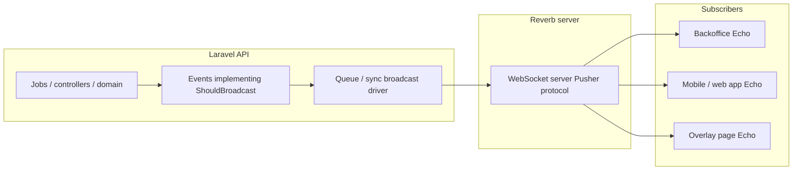

# Laravel Reverb — real-time events (Tapeya)

Generic guide for adding **self-hosted WebSockets** with **[Laravel Reverb](https://laravel.com/docs/reverb)** so the API can push **real-time updates** to **multiple clients** (backoffice, mobile app, public overlay pages) over time. This does not replace HTTP APIs; it **augments** them for live UI and graphics.

**Related:** [Broadcast overlay & browser sources](./BROADCAST_OVERLAY_CRICKSLAB_REFERENCE.md) · [Match controllers (backoffice)](./MATCH_CONTROLLERS_BACKOFFICE.md)

---

## 1. Why Reverb here

| Goal | Fit |
|------|-----|
| Same Laravel app emits events | Use `ShouldBroadcast` / `broadcast()` with **Laravel Broadcasting**. |
| Backoffice (Angular) + future app + overlay | All can use **Laravel Echo** (or any Pusher-protocol client) against Reverb. |
| Avoid per-message SaaS cost at first | Reverb runs like a **long-lived process** on your servers. |
| Channel rules in PHP | **`routes/channels.php`** authorizes who may subscribe. |

**Alternatives:** managed **Pusher** / **Ably** (less ops, recurring cost); **Soketi** (Pusher-compatible, self-hosted). Reverb is the **first-party** choice when the API is Laravel.

---

## 2. Mental model



1. Application code **dispatches** a broadcastable event (or calls `broadcast()`).
2. Laravel sends the payload to **Reverb** (via the configured broadcast connection).
3. Reverb delivers messages to **every socket subscribed** to the event’s **channel(s)**.
4. Each client **subscribes** only to channels it is allowed to hear (enforced in `routes/channels.php`).

---

## 3. Setup outline (when you enable it)

### Tapeya API (implemented)

- **Package:** `laravel/reverb` (Composer). Config: `config/broadcasting.php`, `config/reverb.php`, `routes/channels.php`.
- **Env:** See `api/.env.example` — `BROADCAST_CONNECTION=reverb`, `REVERB_APP_*`, `REVERB_HOST` / `REVERB_PORT` / `REVERB_SCHEME`, optional `REVERB_ALLOWED_ORIGINS` (comma-separated hostnames, e.g. `dev-backoffice.example.com`; full URLs are normalized in `config/reverb.php`; default `*`).
- **Auth for private channels:** `POST/GET /broadcasting/auth` is registered with **`api` + `auth:api`** (Sanctum bearer token). Point **Laravel Echo** `authEndpoint` at `{APP_URL}/broadcasting/auth` and send the same `Authorization` header as other API calls.
- **Run Reverb:** `composer reverb` from `api/` or **`php artisan reverb:start`**. **`composer dev`** in `api/` also starts Reverb alongside `serve`, queue, pail, and Vite.
- **Live events (current):** Database notifications are mapped to **named** broadcast events via `ResolveAdminInboxBroadcast` / `ResolveUserNotificationBroadcast` (see `App\Support\Broadcast\BroadcastEventNames`). **Admin inbox** (`private-backoffice.notifications`): e.g. `.admin.order.placed`, `.admin.tournament_request.submitted`, `.admin.user.registered`. **App user** (`private-App.Models.User.{id}`): e.g. `.user.order.placed`, `.user.order.status_updated`. Clients subscribe to **all** names listed in their `broadcast-events` config and refetch / invalidate on any match. Match graphics are **not** broadcast yet.
- **Backoffice Echo config:** `backoffice/src/environments/environment.development.ts` → `reverb` block (`appKey` must match `REVERB_APP_KEY`). Production template has `reverb.enabled: false` until you configure **wss** and keys.
- **App Echo config:** Defaults live in **`app/src/config/reverb.js`** (aligned with `api/.env.example`). Optional **`VITE_REVERB_*`** overrides; **`VITE_REVERB_ENABLED=false`** disables the listener. For production, set **`VITE_REVERB_*`** (or defaults) to match your API Reverb host, port, scheme, and app key.
- **Shop / user push timing:** **`OrderPlaced`**: `SendOrderPlacedCustomerDatabaseNotification` (sync) writes the customer DB row + broadcast in the checkout request; mail/SMS + admin inbox stay on **`SendOrderPlacedNotifications`** (queued). **`OrderStatusUpdated`**: customer DB is sync; mail is queued (see notifications in `app/Notifications`).

### General checklist (Laravel docs)

Follow the **current** [Laravel Reverb documentation](https://laravel.com/docs/reverb) for scaling, TLS, and upgrades:

1. Set **`BROADCAST_CONNECTION=reverb`** and Reverb app credentials / host / port / scheme.
2. Run **`php artisan reverb:start`** in dev; in production use **Supervisor**, **systemd**, or your PaaS worker type.
3. Terminate **TLS** at a reverse proxy or load balancer in front of Reverb if browsers use **`wss:`**.

**Queues:** Admin inbox notifications are often created inside **queued** notification jobs; **`NotificationSent`** (and thus the Reverb broadcast) runs when the job executes—keep **`php artisan queue:work`** running in dev if you use `ShouldQueue` on those notifications. The broadcast event itself uses **`ShouldBroadcastNow`**.

---

## 4. Environment variables (conceptual)

Typical entries (names may vary slightly by Laravel version):

| Variable | Role |
|----------|------|
| `BROADCAST_CONNECTION` | `reverb` when using Reverb. |
| `REVERB_APP_ID` / `REVERB_APP_KEY` / `REVERB_APP_SECRET` | Credentials Echo and Reverb agree on. |
| `REVERB_HOST` / `REVERB_PORT` / `REVERB_SCHEME` | How clients reach the WebSocket server (`wss` in production). |

Front-end (Echo) needs the **public** key and **host/port/scheme** the **browser** uses (often different from internal Docker hostnames).

---

## 5. Channel naming strategy (recommended)

Use **predictable, namespaced** channels so backoffice, app, and overlay do not collide and authorization stays clear.

| Audience | Channel type | Example pattern | Use case |
|----------|----------------|-----------------|----------|
| **Backoffice** | `private-` | `private-backoffice.tournament.{tournamentId}` | Live match list / admin dashboards. |
| **Backoffice** | `private-` | `private-backoffice.match.{matchId}` | Match controller, operator tools. |
| **Backoffice user** | `private-` | `private-backoffice.user.{userId}` | Personal notifications, “your session” toasts. |
| **Consumer app** | `private-` | `private-app.user.{userId}` | In-app alerts, live match follow. |
| **Consumer app** | `private-` | `private-app.match.{matchId}` | Public match detail with auth-only extras (if needed). |
| **Overlay (browser source)** | `private-` or `public-` | `private-overlay.match.{matchId}` or `public-overlay.match.{token}` | Graphics page: prefer **unguessable token** or signed subscribe if the URL is semi-public. |

**Rules of thumb:**

- Prefer **`private-`** channels whenever the payload is not meant for the whole internet; implement **`routes/channels.php`** callbacks that return `true` only for allowed users/tokens.
- Use **`presence-`** only when you need **“who is online”** (e.g. multiple operators on the same match).
- Keep **event names stable** (`MatchGraphicStateUpdated`) and **version payloads** (`v1`, `v2`) if clients will ship on different release cadences.

---

## 6. Laravel: defining broadcastable events (generic pattern)

Create an event that implements **`Illuminate\Contracts\Broadcasting\ShouldBroadcast`** (or **`ShouldBroadcastNow`** to skip the queue when appropriate).

**Illustrative shape** (not drop-in code):

```php
namespace App\Events\Backoffice;

use Illuminate\Broadcasting\Channel;
use Illuminate\Broadcasting\InteractsWithSockets;
use Illuminate\Broadcasting\PrivateChannel;
use Illuminate\Contracts\Broadcasting\ShouldBroadcast;
use Illuminate\Foundation\Events\Dispatchable;
use Illuminate\Queue\SerializesModels;

class MatchSessionActivityBroadcast implements ShouldBroadcast
{
    use Dispatchable, InteractsWithSockets, SerializesModels;

    public function __construct(
        public int $matchId,
        public string $action,
        public array $payload,
    ) {}

    public function broadcastOn(): array
    {
        return [
            new PrivateChannel('backoffice.match.'.$this->matchId),
        ];
    }

    public function broadcastAs(): string
    {
        return 'match.session.activity';
    }

    public function broadcastWith(): array
    {
        return [
            'match_id' => $this->matchId,
            'action' => $this->action,
            'payload' => $this->payload,
        ];
    }
}
```

**Dispatch** from a controller, action, or observer after persistence:

```php
event(new MatchSessionActivityBroadcast($matchId, 'graphic_command_applied', $payload));
```

**Channel authorization** (same string without the `private-` prefix in the callback):

```php
// routes/channels.php
Broadcast::channel('backoffice.match.{matchId}', function ($user, int $matchId) {
    // return true if $user may operate this match (policy / role / tournament access)
    return $user->can('operateMatch', [TournamentMatch::class, $matchId]);
});
```

Repeat the pattern for **app** channels under a different prefix, e.g. `app.match.{matchId}`, with **policies** suited to end users.

---

## 7. Example scenarios (backoffice vs app)

### 7.1 Backoffice — match controller / graphics

| Event idea | Channel | Payload idea |
|------------|---------|----------------|
| Graphic command applied | `private-backoffice.match.{id}` | Command key, display mode, snapshot id |
| Session settings changed | `private-backoffice.match.{id}` | Theme id, team colors, flags |
| Caption updated | `private-backoffice.match.{id}` | Caption text, slot |
| Another operator joined | `presence-backoffice.match.{id}` (optional) | User id, name |

**Consumers:** Angular backoffice uses **Echo** to refresh UI without polling; multiple tabs stay aligned.

### 7.2 Consumer app — live experience

| Event idea | Channel | Payload idea |
|------------|---------|----------------|
| Match score tick | `private-app.match.{id}` or public read model | Runs, wickets, overs (minimal fields) |
| Match status changed | `private-app.match.{id}` | `live`, `break`, `completed` |
| User-specific alert | `private-app.user.{id}` | “Your team’s match started” |

**Consumers:** Future mobile or web app subscribes only to matches the user follows; keeps **payloads small** and **idempotent** where possible.

### 7.3 Overlay page (vMix / OBS browser)

| Event idea | Channel | Payload idea |
|------------|---------|----------------|
| Overlay state snapshot | `private-overlay.match.{id}` (or tokenized channel) | Current visible graphic + data for renderer |

**Note:** The overlay bundle may be a **separate SPA**; it still uses the same Reverb host and Echo, with **channel auth** possibly based on a **token** in the overlay URL (query or path) validated in `routes/channels.php`.

---

## 8. Front-end: Echo + Reverb (conceptual)

Clients need:

- **`laravel-echo`** and **`pusher-js`** (Reverb speaks the Pusher protocol).
- Configuration: **key**, **wsHost**, **wsPort**, **wssPort**, **`forceTLS`**, **`enabledTransports`**, **`authEndpoint`** for private channels (Sanctum/session or token).

**Backoffice (Angular):** Instantiate Echo once (service/singleton), subscribe in components that care about a given `matchId`, **unsubscribe** in `ngOnDestroy`.

**App / overlay:** Same library stack; different **auth** (e.g. Sanctum SPA cookie vs bearer token for `authEndpoint`).

---

## 9. Security checklist

- [ ] **Never** put secrets in public channels; assume **any subscriber** on that channel sees the payload.
- [ ] **Authorize** every `private-` and `presence-` channel in **`routes/channels.php`**.
- [ ] **Throttle** or debounce high-frequency events (e.g. score ticks) if needed.
- [ ] **CORS** and **Sanctum** (or API tokens) configured so **`/broadcasting/auth`** works from each front-end origin.
- [ ] Overlay URLs: prefer **opaque tokens** or **short-lived signed** subscribe over guessable integer ids if the page is loadable without login.

---

## 10. Scaling and operations

- **Single Reverb node:** simplest; good for early production.
- **Multiple API + Reverb instances:** use **Redis** as the broadcast driver backend so all nodes publish to the same fan-out (see Laravel docs for **scaling Reverb**).
- **Monitoring:** process uptime, connection count, memory; alert if Reverb restarts during a live event.

---

## 11. Future features — how to extend

When adding a new real-time feature:

1. **Name** the channel and event (`broadcastAs`).
2. **Add** `broadcastOn` / payload on a new or existing event class.
3. **Authorize** the channel.
4. **Subscribe** in the relevant client(s); handle **reconnection** (Echo does much of this).
5. **Document** the event contract in this file or a small **“Broadcasting contract”** section per domain (graphics, scoring, notifications).

Keeping **HTTP resources** the **source of truth** for full state and using broadcasts for **deltas or “please refetch”** signals keeps clients simpler and avoids huge socket payloads.

---

## 12. References

- [Laravel Broadcasting](https://laravel.com/docs/broadcasting)
- [Laravel Reverb](https://laravel.com/docs/reverb)
- [Laravel Echo](https://laravel.com/docs/broadcasting#client-side-installation)

---

*Internal doc for Tapeya. Reverb is installed in the API; verify host/TLS and scaling against your Laravel version’s documentation.*
