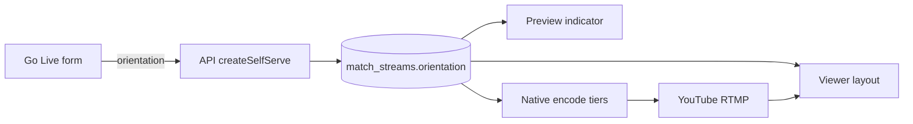

# Go Live Orientation — Portrait (9:16) + Landscape (16:9)

**Status:** Phase A + B + C implemented — form/API persist, native encode tiers, preview indicator, viewer branching; device QA still required before release  
**Date:** July 2026  
**Prerequisites:** [LIVE_STREAM_MOBILE_BROADCAST.md](./LIVE_STREAM_MOBILE_BROADCAST.md) (self-serve Go Live, `TapeyaBroadcastPlugin`, YouTube RTMP), [LIVE_STREAM_INDEPENDENT_STREAMS.md](./LIVE_STREAM_INDEPENDENT_STREAMS.md) (`MatchStream` + `LiveStreamResource`)  
**Goal:** Let broadcasters choose **Portrait** or **Landscape** when creating a self-serve stream, encode to that aspect on Android and iOS, show a clear **selected orientation indicator on the camera preview**, and play the stream back in the matching viewer layout — without breaking today’s portrait-only path.

---

## Why this exists

Today every self-serve Go Live:

| Layer | Behaviour |
|-------|-----------|
| Form | Title + description only — no aspect choice |
| Encode (iOS + Android) | Hardcoded **portrait 9:16** (1080×1920 → step-downs) |
| Preview | Full-bleed camera; no reminder of aspect mode |
| Viewer | Self-serve live forced to **portrait hero** (`fillPortrait`); landscape rotate disabled |

That is correct for phone-upright creators, but wrong for creators who want a **horizontal 16:9** broadcast (sideways phone, desk setup, wider framing). Viewers of those streams currently get a stretched/cropped portrait shell.

**Product decision:** support **both** modes from day one of this update, chosen once on the Go Live form, persisted on the stream, honored by native encode + preview chrome + viewer.

---

## Non-goals

- Web browser encoding (Go Live remains **native-only**)
- Changing YouTube CDN create profile (`1080p` / `30fps` stays)
- Separate YouTube channels per orientation
- Guessing aspect from device sensors after create — orientation is an **explicit form choice**
- Changing match-linked / admin OBS streams (already landscape-oriented in the viewer)

---

## Product principles

1. **Portrait remains the default.** Existing mental model and allowlisted creators keep working with zero new taps if they leave the default.
2. **One choice, locked at create.** Orientation is selected on `/live/go-live` before the stream row exists. It is **not** editable after `POST /live/broadcasts` (avoids mid-session encode/viewer mismatch).
3. **Preview always confirms the choice.** On `/live/go-live/:streamId`, a persistent **selected orientation indicator** shows Portrait or Landscape so the broadcaster never publishes the wrong aspect by accident.
4. **Server field drives the viewer.** Never infer layout from `is_self_serve` alone. Use the stored `orientation` (or equivalent) so landscape self-serve can reuse match-style 16:9 chrome.
5. **Ship carefully.** Default `portrait` everywhere first; dual encode + viewer branch behind the same field; device smoke tests before promoting.

---

## User experience

### 1. Go Live form — orientation picker

**Screen:** `PreBroadcast` (`/live/go-live`)

Add a required field (default **Portrait**):

| Option | Label | Aspect | Helper |
|--------|-------|--------|--------|
| `portrait` | Portrait | 9:16 | Hold your phone upright. Best for selfie / vertical framing. |
| `landscape` | Landscape | 16:9 | Hold your phone sideways. Best for wider / horizontal framing. |

**UI pattern (recommended):**

- Segmented control or two large selectable cards (not a buried dropdown).
- Selected card: accent border + check / filled radio + slight fill.
- Unselected: muted border, no check.
- Place **above** the primary CTA, after title/description (or immediately under title if we want the choice early).
- Optional micro-illustration: phone outline upright vs sideways.

**Validation:** `orientation` required; enum `portrait | landscape`; default `portrait` in the form schema.

**Submit payload:**

```json
{
  "title": "Evening nets",
  "description": "Optional",
  "orientation": "landscape"
}
```

### 2. Camera preview — selected orientation indicator

**Screen:** `DuringBroadcast` (`/live/go-live/:streamId`)

While the native camera underlay is visible (idle preview **and** while live), show a compact, always-readable **Selected orientation indicator** in the broadcast chrome.

#### What it shows

| Orientation | Indicator copy | Optional icon |
|-------------|----------------|---------------|
| Portrait | `Portrait · 9:16` | Phone upright |
| Landscape | `Landscape · 16:9` | Phone sideways |

#### Placement & behaviour

| Rule | Detail |
|------|--------|
| Placement | Near the existing broadcast header / status cluster (top), so it stays visible with Snapchat-style floating controls |
| Persistence | Visible in preview **and** while publishing (same chip; do not hide after “Start Broadcasting”) |
| Source of truth | Stream record from `GET /live/broadcasts/{id}` / live stream resource — **not** local form state alone |
| Read-only | Indicator is **not** a control; changing orientation requires ending and creating a new broadcast |
| Contrast | High-contrast pill / chip over the camera (scrim or solid ink chip) so it remains legible on bright outdoor video |
| Accessibility | `aria-label` e.g. `Selected orientation: Landscape 16:9` |

#### Visual sketch

```
┌──────────────────────────────────────┐
│  ←  You're live · 00:12:04           │
│      ┌─────────────────────────┐     │
│      │  Landscape · 16:9   ✓   │ ← selected indicator
│      └─────────────────────────┘     │
│                                      │
│           (native camera)            │
│                                      │
│              ( ● capture )           │
└──────────────────────────────────────┘
```

For portrait mode the same chip reads `Portrait · 9:16`.

#### Optional (recommended) preview framing hint

When `orientation === 'landscape'`:

- Prefer locking the app UI / activity to landscape while on the preview screen (Capacitor Screen Orientation or native lock), **or**
- Show a soft “Rotate your phone” coach mark until `window.orientation` / screen metrics match landscape.

When `orientation === 'portrait'`: keep today’s upright full-bleed behaviour; no rotate coach mark.

> The indicator is mandatory in v1. Screen lock / coach mark is strongly recommended so encode framing matches what the creator sees.

### 3. Viewer playback

| Stream `orientation` | Viewer behaviour |
|----------------------|------------------|
| `portrait` | Current self-serve live hero: full-bleed `fillPortrait`; landscape rotate toggle stays off |
| `landscape` | Match-stream style: **16:9** player box in portrait shell; landscape rotate toggle **allowed** (same path as match-linked streams) |
| Missing / null (legacy rows) | Treat as **`portrait`** for backward compatibility |

Hub cards / thumbnails can stay landscape-card sized; that is marketing chrome, not encode aspect.

---

## End-to-end flow (updated)

```
Sidebar "Go Live"
  → /live/go-live  PreBroadcast
       title, description, orientation (portrait | landscape), optional thumbnail
  → POST /live/broadcasts { title, description, orientation }
       → createSelfServe(…, orientation)
       → persist on match_streams
       → YouTube RTMP provision (unchanged)
  → navigate /live/go-live/:streamId
  → native preview + Selected orientation indicator (from stream.orientation)
  → Start Broadcasting
       → POST …/start
       → startBroadcast({ rtmpUrl, streamKey, orientation, … })
       → native encode tiers for that orientation → YouTube RTMP
  → viewers GET /live/streams/:id
       → branch layout on orientation (not only is_self_serve)
```



---

## Data model

### Preferred: dedicated column

```php
// migration
$table->string('orientation', 16)->default('portrait')->after('description');
// values: portrait | landscape
```

- Default `portrait` so existing rows and clients stay correct.
- Index not required for v1 (low cardinality; filter later if needed).

### Acceptable lighter first step

Store under `provider_metadata.orientation` and expose via `LiveStreamResource` as top-level `orientation` (resource always normalizes). Prefer a real column before long-term analytics / admin filters.

### Resource contract

`LiveStreamResource` (and owner broadcast show payload) must include:

```json
{
  "id": 123,
  "title": "Evening nets",
  "is_self_serve": true,
  "orientation": "landscape"
}
```

Helpers:

```php
public function orientation(): string
{
    $value = $this->orientation /* column */
        ?? ($this->provider_metadata['orientation'] ?? null);

    return in_array($value, ['portrait', 'landscape'], true)
        ? $value
        : 'portrait';
}
```

---

## API changes

### `POST /api/v1/live/broadcasts`

| Field | Rules |
|-------|--------|
| `title` | existing |
| `description` | existing, optional |
| `orientation` | optional for backward-compatible clients; if omitted → `portrait`; if present → `in:portrait,landscape` |

`LiveBroadcastController::store` → `LiveStreamService::createSelfServe($ownerUserId, $title, $description, $orientation)`.

### `GET /live/broadcasts/{stream}` / `GET /live/streams/{id}`

Return `orientation` so:

- `DuringBroadcast` can render the selected indicator
- `LiveBroadcast.jsx` can choose portrait hero vs 16:9 chrome

No change to RTMP credential shape.

---

## Native encode (Android + iOS)

### JS bridge

Extend `startBroadcast` options:

```ts
{
  rtmpUrl: string
  streamKey: string
  orientation?: 'portrait' | 'landscape'  // default portrait
  resolution?: '720p' | '1080p'           // quality tier within aspect
  maxDurationSeconds?: number
  streamId?: string | number              // Android FGS deep-link
}
```

`DuringBroadcast` **must** pass `orientation` from the stream record on every publish start / retry.

### Resolution tier tables

| Mode | Tier 1 | Tier 2 | Tier 3 |
|------|--------|--------|--------|
| Portrait (today) | 1080×1920 | 720×1280 | 480×854 |
| Landscape (new) | 1920×1080 | 1280×720 | 854×480 |

Bitrates can mirror the existing portrait ladder (e.g. ~2.5 Mbps top tier) unless device testing shows landscape needs a different ceiling.

### Android (`TapeyaBroadcastPlugin.kt`)

- Select tier table from `orientation`.
- `prepareEncoder` already branches on the **actual** resolution passed in (`portraitOut = resolution.height > resolution.width`) — landscape does **not** need a separate “skip forced rotation” change. Once a landscape tier (width > height) is selected, the existing rotation path does the right thing for free.
- Real Android work for Phase B: landscape tier table + plumb `orientation` from JS into tier selection (and keep honoring `resolution` within that table).

### iOS (`TapeyaBroadcastPlugin.swift`)

- Replace hardcoded `videoSize: 1080×1920` / step-down list with orientation-aware tables.
- Set `VideoCodecSettings.videoSize` with **width > height** for landscape.
- Today iOS ignores JS `resolution` — while touching this path, honor both `orientation` and `resolution` so platforms stay aligned.

### Preview layout

- Preview surface should fill the safe area as today.
- Indicator is **JS chrome** over the underlay (not painted by native), so both platforms stay consistent with one React component.

---

## App viewer changes

### Today (problem)

`LiveBroadcast.jsx` / `LiveBroadcastItem.jsx` treat **all** self-serve live as portrait hero and hide landscape toggles via `selfServeChrome`.

### Target

```text
const orientation = broadcast.orientation === 'landscape' ? 'landscape' : 'portrait'
const isSelfServe = isSelfServeLiveBroadcast(broadcast)

const heroMode = isSelfServe && isLive && orientation === 'portrait'
const selfServeChrome = isSelfServe && orientation === 'portrait'
// landscape self-serve → match-like 16:9 + allow rotate toggles
```

| Condition | `fillPortrait` | Landscape toggle |
|-----------|----------------|------------------|
| Self-serve + live + portrait | yes | hidden |
| Self-serve + live + landscape | no | allowed |
| Self-serve + idle/ended | no (classic box) | per existing classic rules |
| Match / admin | no | allowed |

Legacy streams without `orientation` → portrait rules.

---

## Form & shared validation

| File | Change |
|------|--------|
| `app/src/lib/validations/goLive.js` | Add `orientation: z.enum(['portrait', 'landscape']).default('portrait')` |
| `app/src/pages/live/PreBroadcast.jsx` | Orientation picker UI + submit field |
| `app/src/store/api/liveApi.js` | Create mutation body includes `orientation` |
| `app/src/pages/live/DuringBroadcast.jsx` | Selected indicator chip; pass `orientation` into `startBroadcast` |
| `app/src/features/stream/BroadcastCameraChrome.jsx` (or sibling) | Presentational chip for the indicator |
| `app/src/pages/live/LiveBroadcast.jsx` | Branch hero / chrome on `orientation` |
| `app/src/lib/utils/liveStreamUtils.js` | Optional `getStreamOrientation(broadcast)` helper defaulting to portrait |

---

## Trust, safety, and ops notes

- Orientation does **not** change moderation rules, max duration, or allowlist gates.
- Backoffice monitor players that assume `aspect-video` remain correct for **landscape** self-serve; for **portrait** self-serve, monitor UI may letterbox — acceptable for v1, optional later enhancement to honor `orientation` in admin preview.
- Analytics (optional follow-up): count creates / completes by orientation to see adoption.

---

## Phased implementation (careful rollout)

### Phase A — Contract (safe default)

1. Migration / metadata + `createSelfServe` accepts `orientation` (default `portrait`).
2. Resource exposes `orientation`.
3. Form picker + validation + API submit.
4. **No encode/viewer behaviour change yet** — every stream still encodes and plays as portrait, but the field is stored.

**Exit:** create a landscape-labelled stream; DB/API show `landscape`; publish still portrait (known interim). Indicator may already read Landscape if wired early — only enable indicator when encode also honors the field (prefer Phase B together).

### Phase B — Encode + indicator (device-critical)

1. Android landscape tier table + plumb `orientation` into tier selection (`prepareEncoder` already handles aspect from width/height).
2. iOS landscape `videoSize` + step-downs; honor bridge options.
3. `DuringBroadcast` passes `orientation` into `startBroadcast`.
4. Ship **Selected orientation indicator** on preview / live chrome.
5. Optional screen orientation lock / rotate coach mark for landscape.

**Exit:** real-device publish of both modes to YouTube; confirm YouTube Studio / playback aspect matches choice; indicator matches encode.

### Phase C — Viewer

1. Branch `LiveBroadcast` / `LiveBroadcastItem` on `orientation`.
2. Landscape self-serve: 16:9 + rotate toggle.
3. Portrait self-serve: keep current hero.
4. Legacy null → portrait.

**Exit:** two test streams side-by-side on hub; layouts correct on iOS + Android viewers (and web viewer for playback).

### Phase D — Hardening

1. Feature tests: validation enum, default, resource shape.
2. Adapter/unit coverage for orientation helper.
3. Update [LIVE_STREAM_MOBILE_BROADCAST.md](./LIVE_STREAM_MOBILE_BROADCAST.md) architecture diagram to mention orientation.
4. Brief QA checklist on physical devices (see below).

Do **not** merge Phase B without device checks. Portrait regression on either OS is a release blocker.

---

## Device QA checklist

| # | Case | Platform | Expect |
|---|------|----------|--------|
| 1 | Create with default Portrait | iOS + Android | Indicator `Portrait · 9:16`; encode 9:16; viewer hero fill |
| 2 | Create Landscape | iOS + Android | Indicator `Landscape · 16:9`; encode 16:9; viewer 16:9 + rotate works |
| 3 | Landscape publish after app background | Android FGS | Still publishing; aspect unchanged |
| 4 | Camera flip / mute | Both | Works in both orientations |
| 5 | Quality step-down under heat/network | Both | Stays within the chosen aspect table |
| 6 | Legacy stream without orientation | Both viewers | Behaves as portrait |
| 7 | Form omit orientation (old client) | API | Defaults to portrait |
| 8 | Indicator not tappable | Both | No accidental mode switch |

---

## File checklist

### Docs / product

- [x] `docs/LIVE_STREAM_ORIENTATION.md` (this document)
- [ ] Cross-link from `docs/LIVE_STREAM_MOBILE_BROADCAST.md` (short “Orientation” subsection)

### API

- [x] Migration: `match_streams.orientation` (or metadata write path)
- [x] `LiveStreamService::createSelfServe` signature + persist
- [x] `LiveBroadcastController::store` validation
- [x] `LiveStreamResource` (+ owner broadcast resource if separate)
- [x] Feature tests in `SelfServeBroadcastTest` (or sibling)

### App — form & preview

- [x] `goLive.js` schema
- [x] `PreBroadcast.jsx` picker
- [x] `liveApi.js` create body
- [x] Selected orientation indicator component
- [x] `DuringBroadcast.jsx` wire indicator + `startBroadcast({ orientation })`
- [x] `tapeyaBroadcast.js` JSDoc / options

### Native

- [x] `TapeyaBroadcastPlugin.kt` — landscape tiers + orientation → tier selection
- [x] `TapeyaBroadcastPlugin.swift` — landscape `videoSize` + tiers + honor options

### App — viewer

- [x] `LiveBroadcast.jsx` / `LiveBroadcastItem.jsx` orientation branching
- [x] `liveStreamUtils.js` helper + tests if present

---

## Decision log

| Decision | Choice | Rationale |
|----------|--------|-----------|
| Where to choose aspect | Go Live form | Clear intent before RTMP row exists; no mid-stream flip |
| Default | `portrait` | Zero regression for current creators |
| Persist how | Dedicated column preferred | First-class for API/viewer; metadata OK for spike only |
| Preview feedback | Persistent selected indicator | Prevents “I thought I was landscape” mistakes |
| Viewer branching | On `orientation`, not `is_self_serve` | Landscape self-serve must look like 16:9 match streams |
| YouTube CDN | Unchanged 1080p/30fps | Aspect is an encoder property; ingest profile already accepts both |
| Editable after create? | No | Encode + viewer + indicator must stay consistent for the stream’s life |

---

## Known limitations (post Phase A–C)

| Item | Status |
|------|--------|
| Landscape screen **lock** (Capacitor Screen Orientation) | **Shipped** — the broadcast screen hard-locks the device to the selected orientation via `@capacitor/screen-orientation` (see below); the soft rotate coach mark now only shows as a web/plugin-unavailable fallback |
| Desktop web portrait self-serve live | Still classic 16:9 box (letterboxed); hero fill remains mobile-only |
| Device QA on physical iOS/Android | **Required before release** — portrait regression is a blocker |
| Hub card aspect badge | `orientation` is on `LiveStreamResource` but hub cards do not surface it yet |

---

## Broadcast screen orientation lock

The go-live **broadcaster** screen (`DuringBroadcast.jsx`) hard-locks the whole native view to the
stream's orientation so the WebView chrome (LIVE badge, timer, network, viewer count, comments,
capture/flip/mute) **and** the native camera preview surface rotate together as one coherent unit.
This is why a native lock is used instead of CSS-rotating only the DOM chrome (as the viewer does):
the broadcaster's preview is a native surface synced to a JS rect, so DOM-only rotation would leave a
portrait-shaped preview under rotated chrome.

**Flow**

- `useBroadcastOrientationLock({ orientation })` locks to `landscape` or `portrait` on mount and
  whenever the resolved orientation changes.
- The resulting orientation change fires `resize`, and `useBroadcastNativePreview` re-syncs the
  native preview to the new full-window rect automatically — no extra wiring.
- On unmount it snaps back to `portrait` so returning to the (portrait-first) app is deterministic.
- Returns `orientationLocked`; when `false` (web, or plugin unavailable) the screen falls back to the
  soft "Rotate your phone sideways" coach mark for landscape.

**Files**

- `app/src/native/screenOrientation.js` — defensive `lock/unlock` wrapper (no-op on web).
- `app/src/features/stream/hooks/useBroadcastOrientationLock.js` — lifecycle lock/restore hook.
- `app/src/pages/live/DuringBroadcast.jsx` — consumes the hook; coach mark gated on `!orientationLocked`.

**Native requirement**

`@capacitor/screen-orientation` (v6, matching the Capacitor 6 stack) must be synced into the native
projects — this happens automatically via the existing `npm run cap:ios` / `npm run cap:android`
scripts (they run `cap sync`). iOS relies on the landscape orientations already declared in
`Info.plist`; no `AppDelegate` change is needed. Android's `MainActivity` already declares
`configChanges="orientation|screenSize|…"`, so the lock rotates the activity **without** recreating
it (the WebView + broadcast survive the rotation).

---

## Native capture orientation (the buffer must match the aspect)

Locking the interface only fixes the chrome + view geometry. The **encoded/captured buffer** must
also be landscape, or the preview and stream come out rotated (a portrait buffer squeezed into a
16:9 frame). The `orientation` selected on the form is passed to `startPreview` **and**
`startBroadcast` so both the preview and the encode are correct.

**iOS (HaishinKit `MediaMixer`)** — the mixer defaults to `videoOrientation = .portrait`. The plugin
now calls `mixer.setVideoOrientation(...)` via `applyVideoOrientation()`, mapping the phone's
physical pose (`UIDevice.current.orientation`) to the capture orientation with the standard
device→capture landscape inversion. It is re-asserted on every `attachVideo` path (start preview,
publish/reconnect, camera flip) and on `orientationDidChangeNotification`, which self-corrects the
lock-vs-preview timing race. `MTHKView` just displays the mixer buffer, so there is no double
rotation once the buffer itself is landscape.

**Android (RootEncoder `GenericStream`)** — `glInterface.autoHandleOrientation = true` already tracks
device orientation, and `prepareEncoder` already swaps buffer dimensions + rotation by aspect. The
gap was that **preview always prepared the portrait tier**; `startPreview` now selects the
orientation's tier ladder so the preview buffer is landscape too (`ensurePreparedForPreview` uses
`resolutionTiers[1]`).

Portrait is untouched on both platforms (it is each encoder's default), so there is no regression to
the existing portrait path.

---

## Summary

Self-serve Go Live gains an explicit **Portrait (9:16)** / **Landscape (16:9)** choice on the create form. That value is stored on the stream, shown as a **selected orientation indicator** on the camera preview, used to pick native encode tiers on Android and iOS, and used by the viewer to choose full-bleed portrait hero vs 16:9 landscape playback. Portrait stays the default so today’s path remains safe while landscape ships behind one shared contract.
