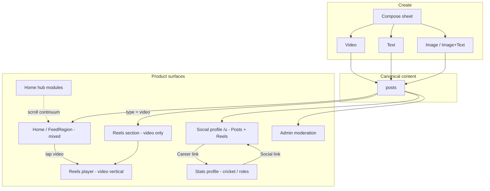
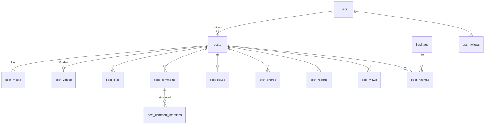

# Social Feed Architecture

**Status:** Direction **approved**; **§17 locked**; **hard cut landed** — `posts` spine live; feed Modules A–E Done (2026-07-27). See [FEED_PRODUCTION_READINESS.md](./FEED_PRODUCTION_READINESS.md).  
**Audience:** Engineering decision + implementation budgeting  
**Related:** [REELS_ARCHITECTURE.md](./REELS_ARCHITECTURE.md) ⚠️ *partially stale — see §2.4*, [FEED_PRODUCTION_READINESS.md](./FEED_PRODUCTION_READINESS.md), [MEDIA_CDN_MIGRATION.md](./MEDIA_CDN_MIGRATION.md), [DEEP_LINKS.md](./DEEP_LINKS.md)

---

## 0. Executive verdict

| Question | Answer |
|----------|--------|
| Kill dual `reels` + `posts` content tables? | **Yes** — adopt a unified `posts` spine (Class Table Inheritance: identity vs format payload). |
| Open product/tech decisions (§17)? | **Locked** — see §17. |
| Ship Reels to production first, then migrate? | **No** — Reels are not deployed yet; hard-cut now is cheaper. Budget the cut as a **multi-week unification**, not a rename. |

**Architectural direction and §17 decisions are approved. Implementation tracker:** [FEED_PRODUCTION_READINESS.md](./FEED_PRODUCTION_READINESS.md) (Modules A–E Done; F+ remaining).

---

## 1. Purpose

The Reels module is **fully built** as a video-only product (API + app + admin + queues + notifications). The client now wants a **Facebook-like unified social feed**:

| Content | Surfaces |
|---------|----------|
| Video | Home Feed + dedicated Reels player/section |
| Text | Home Feed + Posts |
| Image | Home Feed + Posts |
| Image + text | Home Feed + Posts |

- Tap a video in Home Feed → open **Reels player**, continue scrolling **videos only**.
- Keep a dedicated **Reels** tab (immersive vertical player).
- Home = **product hub + mixed social timeline** (scroll continuum — §7.4).
- Profiles = **one social profile** + **one stats/player surface** (§7.5).

This is the cheapest moment to choose a foundation that won’t force a painful migration later (polls, shares, live, stories, ads, articles).

---

## 2. Current state (verified against codebase)

### 2.1 What exists today

| Area | Reality |
|------|---------|
| **Reels backend** | **Shipped in repo:** schema, multipart upload, poster + transcode queues, feeds, engagement, hashtags, follower publish fan-out, push templates |
| **Reels frontend** | `/reels`, `/reels/:id`, `/reels/upload`, `/reels/u/:userId` — wired to API |
| **Admin / backoffice** | Angular: posts list/filter/edit/reprocess/delete; post-reports triage. API: `Admin\PostController`, `Admin\PostReportController`, routes `/admin/posts*`, `/admin/post-reports*` |
| **“Activity Feed” `/feed`** | **Live** — `FeedRegion` + `feedApi` (`GET /feed`, `/feed/following`); compose `/feed/compose`; detail `/feed/:postId` |
| **`/home`** | Product hub **+** embedded `FeedRegion` (same cache as `/feed`) |
| **Profiles (dual today)** | **Stats/roles:** `/profile` (own) — Ranking / Followers / Reels metrics + Overview / Stats / Reels tabs. **Creator:** `/reels/u/:userId` — follow graph + Reels/Liked/Saved grids. Only weakly linked (own “Edit Profile”) |
| **Follow graph** | Real (`user_follows`) |
| **Comment @mentions** | Real on reel comments (`ReelMentionParser` → DB + push + broadcast); text-parsed, not structured `mentioned_user_ids` |

**`posts` / `post_*` tables exist** (hard cut). Engagement aliases under `/posts/{id}/…` + legacy `/reels/{id}/…` (see readiness Module E).

### 2.2 Status vs “published” (important correction)

Real `ReelStatusEnum` (**pipeline** only):

`uploading` | `processing` | `ready` | `failed` | `rejected` | `removed`

There is **no** `draft` or `published` status value.

Feed eligibility is **orthogonal**:

| Column | Meaning |
|--------|---------|
| `status` | Upload / FFmpeg lifecycle |
| `published_at` | When the item becomes feed-eligible (set on first original upload today) |
| `ready_at` | When processed ladder is ready (nullable while still playable from original) |
| `created_at` / `updated_at` | Row lifecycle |

`scopeExplore()` today:

```php
whereNotNull('published_at')
->where('visibility', Public)
->whereNotIn('status', [Uploading, Failed, Rejected, Removed])
// processing AND ready both allowed
```

**Text/image posts** will not need a `ready` phase: set `published_at` at create (or explicit publish). **Video** keeps `ready_at` on `post_videos`.

### 2.3 Views counters (correction)

`views_count` is incremented **atomically in MySQL** on each counted view (`ReelViewCounterBuffer::bump`). Redis buffering is **legacy recovery only** (`reels:flush-view-counters`). Do not design as if list reads depend on a Redis flush cron.

### 2.4 Known bug: following feed vs followers-only visibility

**Bug (shipped today):** `ReelFeedService::following()` filters authors by the follow graph, then applies `scopeExplore()`, which **forces `visibility = public`**. A creator’s `followers`-only reel **never** appears in followers’ Following feed, even though `findVisible()` correctly allows it for single-item access.

**This redesign must fix that rule in the new `PostFeedService`, not inherit it.** See §9.

### 2.5 [REELS_ARCHITECTURE.md](./REELS_ARCHITECTURE.md) is stale

That doc still says backend is “greenfield / design.” **Ignore its implementation-phase claims.** Use it only for historical R&D notes (codecs, etc.). This social-feed doc is the planning source of truth for the content model going forward; Reels docs should be rewritten as “video surface over `posts`” after the cutover.

### 2.6 Shortcomings of staying reel-only forever

1. Content identity = “reel” → text/image need a duplicate social stack.
2. Video pipeline columns don’t belong on every text row (hence extension table).
3. Views are video-specific; impressions need different semantics.
4. Hashtags / notifications / admin / deep links are reel-scoped.
5. ~~Mock `/feed` vs real Reels split~~ — resolved: shared `posts` spine + dual UX surfaces.

---

## 3. Product surfaces (target)



**Rules**

1. One canonical content row per publication (`posts`).
2. Video posts are posts **and** Reels-surface members.
3. Home Feed queries the same table — no second copy of videos.
4. Same public id in Home, Social profile, Reels player, admin, deep links.
5. Home hub scrolls into the same FeedRegion as dedicated `/feed`.
6. Social profile owns UGC; stats profile owns cricket/roles.

---

## 4. Options evaluated

### Option A — Keep `reels` + add `posts`

Dual content sources + UNION/merge for Home.  
**Reject** for long-term (duplicate engagement, hashtags, admin, notifications). Temporary bridge only if forced.

### Option B — One wide `posts` table (all video columns on every row)

**Reject** for scale — sparse nulls, weak invariants.

### Option C — Spine + extensions + shared engagement (**recommended**)

```
posts + post_media + post_videos(+ future extensions) + post_* engagement
```

**Approve.** Matches Class Table Inheritance used by FB/IG-style systems: object identity ≠ format payload.

### Option D — Fully polymorphic morph-map likes everywhere

**Avoid** for primary UGC. Prefer `post_id` FKs. Morph maps remain OK for notifications / cross-domain events.

---

## 5. Industry parallel (simplified)

| Product | Pattern |
|---------|---------|
| Facebook | Post as primary object; attachments; News Feed ranks post IDs |
| Instagram | Media objects + Reels as format/surface; feed mixes formats |
| TikTok | Video-first objects; For You / Following = ranking surfaces |
| Feed scale | Fan-out-on-write (push to follower timelines) vs fan-out-on-read (query at read time) — see §9 |

---

## 6. Proposed data model

### 6.1 ER overview



### 6.2 `posts` (canonical)

| Column | Notes |
|--------|--------|
| `id` | Canonical content id (see §15 on public exposure) |
| `user_id` | Author |
| `type` | `text` \| `image` \| `video` \| `repost` \| (later `poll` \| `article`) |
| `title` | Optional headline; nullable |
| `body` | Caption/text; nullable for image-only / video-only / bare repost |
| `visibility` | `public` \| `followers` \| `private` |
| `status` | **Reuse pipeline-compatible set:** `uploading` \| `processing` \| `ready` \| `failed` \| `rejected` \| `removed`. Text/image/repost: jump `ready` at publish (no FFmpeg). Optional later: `draft` only if product needs it. |
| `published_at` | Feed eligibility (null = not in feeds) |
| `repost_of_post_id` | Nullable FK → original `posts.id` when `type=repost` |
| Counters | `likes_count`, `comments_count`, `shares_count`, `saves_count`, `reports_count`, `views_count`, `reposts_count` |
| `cover_path` | Optional denormalized card image |
| `created_at`, `updated_at` | |

**Do not** invent a `published` status value that doesn’t exist today.

| `type` | Required | Optional |
|--------|----------|----------|
| `text` | non-empty `body`; `status=ready`; `published_at` set | title |
| `image` | ≥1 image in `post_media` | `body` (image+text) |
| `video` | `post_videos` row; upload pipeline | `body` |
| `repost` | `repost_of_post_id` → visible original (unwrap to root); `status=ready` | quote `body` |

### 6.3 `post_media`

Ordered attachments (images; optional pointers for video display assets).

| Column | Notes |
|--------|--------|
| `post_id`, `kind`, `path`, `disk`, dims, `mime`, `size_bytes`, `sort_order` | |

### 6.4 `post_videos` (1:1 — migrate reel media/pipeline columns)

Includes `original_path`, `processed_path`, `hls_master_path`, `playback_variants`, `thumbnail_path`, `preview_path`, `duration_ms`, dims, `file_size_bytes`, `processing_error`, **`ready_at`**.

### 6.5 Engagement (unified on `post_id`)

| Table | Notes |
|-------|--------|
| `post_likes` / `post_saves` / `post_shares` / `post_reports` | Same patterns as reel_* |
| `post_comments` | Threaded |
| `post_comment_mentions` | **Structured** `(comment_id, mentioned_user_id)` — locked (§11 / §17) |
| `post_views` | Video: watch threshold + `watched_ms` / `completion_rate`. Text/image: impression/dwell. Shared `viewer_key` uniqueness. |

**Share vs repost (locked)**

| Concept | Meaning |
|---------|---------|
| **`post_shares`** | Engagement action: copy link / native share sheet / channel analytics. Does **not** create a new feed row. |
| **`posts.type = repost`** | **v1:** new feed item with `repost_of_post_id` (and optional quote `body`), like IG/X/Facebook “share to feed.” Counts as the reposter’s post; Home/Following show the wrapper + embedded original. |

Repost rules (v1):

- Viewer must be allowed to see the target; **always store the root original** id (unwrap if someone reposts a repost).
- Original author gets a notification (`post_reposted`).
- Deleting the original: repost cards show “original unavailable” (keep wrapper row).
- Engagement on the **repost wrapper** (likes/comments) is separate from the original’s counters; tapping media may deep-link to the original video player when `original.type = video`.
- Optional: increment a denormalized `reposts_count` on the original (reconcile like other counters).

### 6.6 Hashtags / user counters

- `hashtags.posts_count` + `post_hashtag`
- Keep `users.reels_count` as **video posts** counter (product label “Reels”) and/or add `posts_count`
- Add **reconciliation command** for denormalized counters (see §14) — we’ve already seen NULL/`following_count` drift in production-like local DBs

### 6.7 Ads & stories

- **Stories:** separate ephemeral tables + TTL — not Home `posts` ranking.
- **Ads:** ranking-layer injector / campaigns — **not** fake user posts. Avoid `posts.is_sponsored` as the primary model (undercuts separation).

---

## 7. API shape

### 7.1 Principles

1. One `Post` resource; surfaces = filters + serializers.
2. Keep `/reels/*` as **thin adapters** during/after cutover for the app.
3. Type-aware `deep_link`: video → `/reels/{id}`, else → `/posts/{id}` (or in-feed).

### 7.2 Endpoints (sketch)

| Method | Path | Role |
|--------|------|------|
| `GET` | `/feed`, `/feed/following` | Mixed Home |
| `GET/POST/PATCH/DELETE` | `/posts…` | CRUD + media |
| `POST` | `/posts/{id}/video/upload/*` | Multipart (evolved from reel multipart) |
| `GET` | `/reels/feed`, `/reels/{id}` | Video filters / player |
| Engagement | `/posts/{id}/like|comments|save|share|views|report` | One stack |
| Admin | `/admin/posts`, `/admin/post-reports` (same-deploy Angular; no long-lived `/admin/reels*` aliases) | Moderation |
| `POST` | `/posts/{id}/repost` | Create `type=repost` feed item (optional quote body) |

### 7.3 Open video from Home

Navigate `/reels/{postId}` → player loads **video-only** cursor centered on that id (same deep-link prepend pattern as today).

### 7.4 Home shell: hub + scroll-into-feed (locked)

**Product intent:** Keep a **separate Feed product** (Explore / Following, compose, deep links) **and** make **`/home` scroll into that feed** — one continuous page, not a hard cut to a different screen.

Today `/home` embeds the shared `FeedRegion` below the hub; dedicated `/feed` mounts the same component/API. Target layout:

```text
┌─────────────────────────────────────┐
│  HOME HUB (hero, live, shop, …)     │  ← product modules (finite)
├─────────────────────────────────────┤
│  FEED CHROME (Explore | Following)  │  ← becomes sticky when reached
│  mixed post cards (infinite)        │  ← same /feed API as dedicated Feed
└─────────────────────────────────────┘
```

#### How to achieve it (client)

| Piece | Approach |
|-------|----------|
| **Composition** | One `/home` document scroll: hub sections **above**, shared `<FeedRegion />` **below**. Avoid nested scroll containers on mobile. |
| **Same Feed component** | Dedicated `/feed` (and `/feed/:postId`) mounts the **same** `FeedRegion` (tabs + list). Home embeds it; Feed route can open already in “feed mode” (no hub). |
| **Prefetch** | On Home mount, prefetch first Explore (and optionally Following) page so the timeline is warm before the user reaches it. |
| **Feed mode** | `IntersectionObserver` on a sentinel at the top of `FeedRegion`. When the sentinel sticks / crosses the viewport top → enter **feed mode**; scrolling back up past it → exit. |
| **Chrome morph** | In feed mode: pin Explore/Following tabs; optionally solidify navbar; optionally dim/collapse hub chrome. Out of feed mode: restore hub treatment (incl. hero navbar). |
| **URL (optional)** | Soft-sync without remount: `history.replaceState` to `/home#feed` or `/home?surface=feed` when entering feed mode; reverse on exit. Dedicated `/feed` remains a first-class entry (push notifications, share, bottom-nav if added). |
| **Cache** | One RTK Query (or equivalent) cache for `/feed` + `/feed/following` so Home ↔ `/feed` ↔ back does not flash empty. |
| **Deep link to a post** | `/feed/:postId` or in-feed open; video still routes to `/reels/{id}` per §7.3. |

#### Backend

No special “home feed” API. Home and `/feed` both call:

- `GET /feed` — Explore mix (public)
- `GET /feed/following` — Following

Hub modules keep their existing APIs (hero, live, shop, highlights).

#### What not to do

- Two different feed implementations for Home vs `/feed`.
- Waiting until the user hits the bottom of the hub to fire the first `/feed` request.
- Nested overflow scroll for the timeline inside a fixed Home pane (breaks iOS rubber-banding / back-swipe).
- Replacing the hub entirely with feed-only Home (product still wants hub modules).

### 7.5 Profiles: unified social + separate stats (locked)

**Today:** two faces of the same user — `/profile` (stats / roles / edit) and `/reels/u/:userId` (creator / follow / grids) — poorly linked.

**Target:** exactly **two** profile products:

| Surface | Job | Audience |
|---------|-----|----------|
| **Social profile** | Identity + graph + UGC | Public (self + others) |
| **Stats / player profile** | Cricket (and role) performance | Self always; others when we expose public player pages |

UI can change freely; this is the IA / API contract.

#### Social profile (unified)

**Route (recommended):** `/u/:userId` (alias `/reels/u/:userId` during cutover).  
**Owns:** what today’s creator profile does, plus non-video posts.

| Block | Content |
|-------|---------|
| Header | Avatar, name, `@nickname`, bio/location, role pills (display only) |
| Graph | Following / Followers / Posts (and/or Reels count) |
| Actions | Follow/Unfollow, Share, **Edit profile** (own) → settings; link **Career / Stats** → stats surface |
| Tabs (own) | **Posts** (all types) \| **Reels** (`type=video`) \| **Liked** \| **Saved** |
| Tabs (other) | **Posts** \| **Reels** |

**APIs:** `GET /users/:id/profile`, `GET /users/:id/posts`, `GET /users/:id/posts?type=video` (or keep `/users/:id/reels` as adapter), liked/saved, follow mutations.  
**Deep links / mentions / reel avatars** → social profile, not stats.

#### Stats / player profile

**Route (recommended):** `/profile` for **own** multi-role shell (player / organizer / sponsor) as today; public others later as `/players/:id` (or role-specific routes).  
**Owns:** Ranking, career batting/bowling/fielding, teams, organizer/sponsor tabs — **not** the primary UGC grid.

| Block | Content |
|-------|---------|
| Header | Same identity chrome **or** lighter “Career” chrome; link back **View social profile** → `/u/:id` |
| Metrics | Ranking, cricket-specific counters (not feed engagement as the hero) |
| Tabs | Overview / Stats / … (role-specific). **Remove** embedding a half-baked Reels grid here — Reels live on social. |

**APIs:** existing player ranking/stats/teams (and organizer/sponsor). No posts feed required on this surface.

#### Navigation matrix

| From | To |
|------|----|
| Reel / post author chip | Social `/u/:id` |
| Bottom nav Profile | Prefer **own social** `/u/:me` (or keep `/profile` if product wants stats-first — default: **social-first**) |
| Social (own) Edit | Account edit / settings |
| Social ↔ Stats | Explicit cross-links both ways |
| Mentions, follows, `post_published` | Social profile |

#### What not to do

- Keep two competing “main” profiles with overlapping grids.
- Put full career stats inside the social profile as the default tab (keeps social noisy).
- Leave `/reels/u/:id` as a permanent third profile after cutover (alias only).

## 8. Backend package structure (including admin)

```
app/
  Models/Post.php, PostMedia.php, PostVideo.php, PostLike.php …
  Services/Post/
    PostService.php
    PostFeedService.php           # MUST implement correct visibility (§9)
    PostVideoPipelineService.php  # evolved ReelService + multipart + jobs
    PostInteractionService.php
    PostRepostService.php         # create/unwrap/delete repost wrappers
    PostCommentService.php        # mention parsing → structured rows
    PostViewService.php
    PostCounterReconcileService.php
  Http/Controllers/User/PostController.php
  Http/Controllers/User/ReelController.php     # adapter
  Http/Controllers/Admin/PostController.php
  Http/Controllers/Admin/PostReportController.php
```

**Queues:** keep poster/transcode workers; expect **service rewrites**, not constructor renames only.

---

## 9. Feed visibility & fan-out (must decide before coding)

### 9.1 Correct visibility rules (fix today’s bug)

For a viewer `V` and post `P`:

| `P.visibility` | Who sees it in list feeds |
|----------------|---------------------------|
| `public` | Anyone (subject to status / `published_at`) |
| `followers` | Author, or users with `user_follows` where `followed_user_id = P.user_id` |
| `private` | Author only |

**Explore / public Home tab:** public posts only (plus status gates).  
**Following Home tab:** authors ∈ following set **AND** (`public` OR `followers`).  
**v1 Home product (locked):** both tabs — **public Explore mix** + Following (see §17).  
**Single-item show:** same as today’s `findVisible()` spirit.

Pseudo-SQL for following (fan-out-on-read v1):

```sql
SELECT posts.*
FROM posts
WHERE published_at IS NOT NULL
  AND status NOT IN ('uploading', 'failed', 'rejected', 'removed')
  AND user_id IN (/* followed ids */)
  AND (
    visibility = 'public'
    OR visibility = 'followers'
  )
  AND (published_at, id) < (?, ?)
ORDER BY published_at DESC, id DESC
LIMIT 20;
```

### 9.2 Fan-out-on-read vs fan-out-on-write

| Approach | When |
|----------|------|
| **Fan-out-on-read (v1)** | Query posts at read time with follow + visibility predicates. Matches current Reels scale. Ship this first. |
| **Fan-out-on-write (later)** | On publish, enqueue writes into per-follower timeline tables / Redis lists. Needed when following graphs and publish QPS make read-time joins too hot. |

Document explicitly: **v1 = fan-out-on-read with correct visibility.** “v2 ranking / Redis candidate sets” is optional and does **not** replace fixing visibility.

### 9.3 Caching (day one)

- Cursor pages are cheap; **don’t** over-cache personalized Following feeds in v1.
- Cache **public explore** fragments cautiously (short TTL) if needed.
- Always invalidate or bypass cache for the acting user’s own unpublished/private edges.
- Prefer HTTP caching only on truly public CDN media, not on personalized JSON.

---

## 10. Media / upload pipeline — real blast radius

This is **not** “jobs take `post_id` instead of `reel_id`.”

Verified coupling today:

| Layer | Reality |
|-------|---------|
| `MediaRegistry` | Used by generic media endpoints — **not** the main reel multipart path |
| `UserMediaController::TYPES` | Second, drifted type map |
| `ReelMultipartUploadService` | Hard-typed to `Reel`: cache keys `reel:multipart:{id}`, paths `reels/original/{id}/`, `$reel->forceFill` |
| Poster / transcode jobs + services | Write many Reel columns, `ReelStatusEnum`, `ReelProcessingUpdated` broadcast |
| Cleanup / schedule | `reels:purge-expired-originals`, cleanup jobs, supervisor queues |

**Budget:** treat as a **data-model unification across ~30–40+ hard `reel_id` touchpoints**, plus backoffice service URL updates. Multi-week, not a rename PR.

Plan (path namespace **locked** — long-term):

1. Introduce `Post` / `PostVideo` models and tables; migrate rows preserving ids where possible.  
2. **New uploads** use `posts/videos/{id}/…` and `posts/images/{id}/…` (not `reels/…`).  
3. **Migrate existing** local reel objects: rewrite DB paths to the new namespace **or** copy objects + update paths in the migrate script (prefer rewrite/copy so CDN isn’t stuck on `reels/` forever). Dual-read of old `reels/` keys only as a temporary fallback during Phase 1–2.  
4. Rebind multipart + poster + transcode + cleanup to posts.  
5. Unify the two media type registries (stop drifting).  
6. Keep or rename queue worker names in the same deploy as docs/supervisor.

---

## 11. Mentions (already shipped — generalize deliberately)

Today: `ReelMentionParser` parses `@nickname` from comment text; fires mention notifications; **no structured mention rows**.

**Decision (locked):** structured `post_comment_mentions` at cutover.

- Parse on write → upsert mention rows  
- Notifications read structured targets (less re-parse drift)  
- Still allow body display with raw `@nick`

---

## 12. Notifications rename — atomic checklist

Renaming `reel_published` → `post_published` (and likes/comments analogues) touches **at least**:

1. `NotificationEventEnum` case  
2. `PushNotificationTemplateSeeder` + **DB backfill** of `push_notification_templates.key` (otherwise `findTemplate()` throws)  
3. Literal `'type' => '…'` inside notification `toArray()` classes  
4. Admin template preview `match` branches (`PushNotificationTemplate` model)  
5. Deep-link builders → **type-aware**  
6. App `usePushNotifications` / Notification Center routing  
7. `ResolveUserNotificationBroadcast` FQCN map  
8. **Queue drain:** `ShouldQueue` listeners/jobs may serialize old FQCNs — drain `push-notifications` / default queues before deleting old classes, or keep alias classes one release  

Hard-cut is fine pre-launch **only if** this checklist is a gated release step.

---

## 13. Admin / backoffice migration (locked: same-deploy)

**Long-term choice:** update API **and** Angular backoffice in the **same release**. No multi-release `/admin/reels*` alias debt.

| Step | Work |
|------|------|
| API | `Admin\PostController`, `Admin\PostReportController` (parity with today’s reel admin) |
| Backoffice | Point `reel.service.ts` / reports / routes / nav at `/admin/posts*` in the same deploy |
| Reprocess | Only for `type=video` |
| Local/staging | Coordinate deploy so admin never targets removed reel routes |

Optional: tiny **same-release** redirect from old admin paths → new ones only if bookmarks matter; remove within that release train.

---

## 14. Counters & reconciliation

Denormalized counters are required for list performance. Also required:

- COALESCE-safe increments (already learned on `reels_count`)  
- Artisan `posts:reconcile-counters` (likes/comments/saves/shares/views/reports vs truth tables)  
- Run after cutover and periodically  

Views: keep **immediate MySQL increment** on counted view (current behavior).

---

## 15. Public IDs (locked)

**Keep sequential integer ids** (`/reels/{id}`, `/posts/{id}`) for the refactor — matches today’s app and deep links.

- Preserve `reels.id` → `posts.id` on migrate where possible.  
- Rely on visibility checks + rate limits on show endpoints.  
- Revisit opaque ids only if product requires it before a large public launch (out of scope for this cutover).

---

## 16. Indexing & list queries

```text
posts (published_at DESC, id DESC)  -- with partial filters in app
posts (user_id, published_at DESC, id)
posts (type, published_at DESC, id)
-- plus status/visibility predicates as suited to your DB (Postgres partial indexes welcome)

post_media (post_id, sort_order)
post_likes (post_id, user_id) UNIQUE
post_views (post_id, viewer_key) UNIQUE
user_follows (follower_id, followed_user_id)
user_follows (followed_user_id, follower_id)  -- fan-out / reverse lookups
```

Avoid permanent `UNION` of legacy `reels` + `posts`.

---

## 17. Decisions (locked 2026-07-27)

| # | Topic | Decision |
|---|--------|----------|
| 1 | Public ids | **Sequential ints** — keep `/reels/{id}`-style; preserve ids on migrate |
| 2 | Path namespace | **`posts/videos/…` and `posts/images/…`** for new + migrated media (long-term; temporary dual-read of `reels/` only during cutover) |
| 3 | Admin cutover | **Same-deploy** API + Angular update (no multi-release aliases) |
| 4 | Mentions | **Structured** `post_comment_mentions` rows |
| 5 | v1 Home | **Public Explore mix + Following** (tabs) |
| 6 | Repost | **Proper feed repost in v1** (`type=repost` + `repost_of_post_id`); keep share-as-action separately |
| 7 | Home ↔ Feed UX | **Hub on `/home` + scroll-into shared FeedRegion**; dedicated `/feed` reuses same component/API (§7.4) |
| 8 | Profiles | **One social profile** (`/u/:id`) + **one stats/player surface** (`/profile` / players) — §7.5 |

---

## 18. Migration plan (revised — pre-release hard cut with rehearsal)

Because Reels are **not in production**, prefer hard cut **with staging rehearsal**, not “yolo drop tables.”

### Phase 0 — Decisions + docs

- §17 locked.  
- [REELS_ARCHITECTURE.md](./REELS_ARCHITECTURE.md) banner in place; fuller rewrite after cutover.

### Phase 1 — Schema + hard cut (**Done**)

- Create migrations replace reel creates: `posts`, `post_media`, `post_videos`, engagement, hashtags pivot, **`post_comment_mentions`**.  
- Cutover migration: if legacy `reels` present → copy into posts (preserve ids, remap paths to `posts/videos/…`) → **drop all `reels*`**.  
- **No dual-table legacy** after cutover. Prefer `migrate:fresh` on clean local DBs.

### Phase 2 — Backend cut (user + workers) (**mostly Done**)

- Port services/jobs/multipart/broadcasts to Post*.  
- `/reels/*` adapters; `/feed` explore + following; `/posts` CRUD + **repost** + engagement aliases.  
- Fix Following visibility.  
- Notification rename + template backfill + queue drain — **partial** (keys may still say `reel_*`).

### Phase 3 — Admin cut (same deploy as Phase 2 release) (**Pending**)

- Admin API + Angular backoffice switched together.

### Phase 4 — App (**mostly Done** for feed/compose; profile gaps remain)

- Home hub + **scroll-into-feed** (`FeedRegion` shared with `/feed`); Explore + Following.  
- Compose: text / image / video / **repost**.  
- **Unified social profile** `/u/:id` — still backlog (readiness Module H).  
- Retire duplicate Reels-only profile as the primary (keep alias).

### Phase 5 — Drop legacy (**N/A locally after hard cut**; staging/prod gate remains)

- Drop `reels*` after gates; reconcile counters; retain rollback artifacts until sign-off.

### Verification gates

| Gate | Example |
|------|---------|
| Data | `#posts(type=video) == #reels`, likes totals match |
| API | explore/following/show/upload/like/comment/admin reprocess smoke |
| Visibility | followers-only appears in follower’s following feed; not in explore |
| Push | publish → follower receives `post_published` with correct deep link |
| Player | Home video → `/reels/{id}` → swipe stays video-only |
| Home continuum | Scroll past hub → sticky feed tabs; same cache as `/feed` |
| Profiles | Author → social `/u/:id`; stats link does not own UGC grids |

---

## 19. What not to do

1. Dual long-term `reels` + `posts` content tables.  
2. FFmpeg columns on every text post.  
3. Morph-map likes as the primary UGC path.  
4. Client-side merge of two feed APIs for Home.  
5. Inherit `following()` + `scopeExplore()` public-only bug.  
6. Treat multipart/admin/notifications as “rename `reelId`.”  
7. Stories inside chronological `posts` without TTL.  
8. Ads as fake organic posts.  
9. Hard-drop `reels*` before admin + workers + app + queue drain.  
10. Separate Home-feed and `/feed` list implementations.  
11. Nested scroll for the Home timeline.  
12. Keep dual primary profiles (`/profile` grids + `/reels/u/:id`) after social unification.

---

## 20. Decision record

| Question | Decision |
|----------|----------|
| Unified `posts` spine + `post_videos`? | **Yes** |
| Dual content tables forever? | **No** |
| Status model | Keep pipeline statuses; use `published_at` / `ready_at` — no fake `published` status |
| Feed v1 | Fan-out-on-read + **correct** visibility |
| Views | Immediate MySQL increment; impressions separate semantics for non-video |
| Share vs repost | **Both in v1:** share = action; repost = `type=repost` feed item |
| Admin | **Same-deploy** API + Angular |
| Media paths | **`posts/videos|images/…`** (migrate off `reels/`) |
| Public ids | **Sequential ints** (preserve on migrate) |
| Mentions | **Structured** `post_comment_mentions` |
| v1 Home | **Explore + Following** tabs |
| Home ↔ Feed UX | Hub + scroll-into shared `FeedRegion`; `/feed` = same surface |
| Profiles | Social `/u/:id` + Stats `/profile` (player/roles) |
| Media pipeline | Multi-week unification budget |
| REELS_ARCHITECTURE.md | Marked stale; rewrite after cutover |

---

## 21. Appendix — current → proposed map

| Current | Proposed |
|---------|----------|
| `reels` | `posts` + `post_videos` |
| `reel_*` engagement | `post_*` |
| `ReelFeedService::following` | `PostFeedService::following` **with visibility fix** |
| `ReelMultipart*` | `PostVideoMultipart*` under `posts/videos/…` |
| `Admin\Reel*` + Angular reels pages | `Admin\Post*` + same-deploy backoffice update |
| `reel_published` push | `post_published` / `post_reposted` + type-aware deep links |
| `/feed` mock | **Done** — Shared FeedRegion on `/home` + dedicated `/feed` (mock `feedData.js` removed) |
| `/reels/u/:id` + `/profile` Reels tab | Social `/u/:id` (Posts/Reels/…) + Stats `/profile` (career/roles only) — **still backlog** |
| `ReelMentionParser` | parser + `post_comment_mentions` |

---

*Direction and §17 decisions: approved. Hard cut + consumer feed Modules A–E Done — track remaining work in [FEED_PRODUCTION_READINESS.md](./FEED_PRODUCTION_READINESS.md).*
